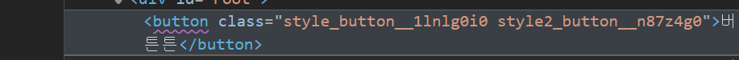

# Vanilla Extract

오늘은 CSS의 세계에서 새로운 패러다임을 제시하고 있는 `vanilla extract`에 대해 공부해보았다.(~~사실 오픈 카톡방에서 자주 얘기가 나와서 어떤 기술인지 궁금했음..~~) 개발자들은 오랫동안 CSS를 구조화하고 유지보수하기 쉽게 만들기 위한 다양한 도구와 방법론을 사용해 왔다. SCSS, CSS-in-JS 등이 그 예다. 각각의 기술을 간략하게 알아보고 `vanilla extract` 을 알아보자.

# Vanilla Extract 란?

공식 홈페이지에서 `vanilla extract`를 이렇게 소개한다.

<aside>
🍧 제로 런타임 스타일 시트 in 타입스크립트

</aside>

[vanilla-extract — Zero-runtime Stylesheets-in-TypeScript.](https://vanilla-extract.style/)

# Vanilla Extract의 특징

## 런타임 오버헤드 없음

대부분의 CSS-in-JS 라이브러리는 런타임에서 스타일을 계산하게 된다. 이로 인해 런타임 성능이 저하될 수 있다. 하지만 `vanilla extract` 는 빌드 타임에서 CSS를 생성하기때문에 **런타임 오버헤드가 없다.**

```jsx
import { style } from '@vanilla-extract/css';

export const className = style({
  color: 'blue',
});
```

위의 코드는 **빌드 타임에** 아래 처럼 변환 된다.

```css
.className_해시 {
  color: blue;
}
```

## 타입 안정성

- **CSS-in-JS(`styled-components`) 예시**:
    
    ```jsx
    import styled from 'styled-components';
    
    // 정상적인 스타일 정의
    const Button = styled.button`
      color: blue;
      background-color: white;
    `;
    ```
    
    ```jsx
    // 잘못된 속성 값 (TypeScript에서는 에러를 감지하지 못함)
    const WrongButton = styled.button`
      color: blu; // 잘못된 색상 값
      background-color: 123; // 숫자는 잘못된 값
    `;
    ```
    
    `styled-components`에서는 스타일링을 할 때 JavaScript의 문자열 템플릿을 사용한다. TypeScript와 함께 사용하더라도, 특정 CSS 속성에 잘못된 값을 넣는 것을 미리 감지하는 것은 어려울 수 있다.
    위 코드에서 잘못된 색상 값과 숫자 값을 사용했지만 이를 감지하지 못한다.
    
- **Vanilla Extract 예시**:
    
    ```tsx
    import { style } from '@vanilla-extract/css';
    
    // 정상적인 스타일 정의
    const button = style({
      color: 'blue',
      backgroundColor: 'white',
    });
    ```
    
    ```jsx
    // 잘못된 속성 값 (TypeScript에서 에러를 감지)
    const wrongButton = style({
      color: 19, // 에러: 숫자는 잘못된 값
      backgroundColor: 123, // 에러: 숫자는 잘못된 값
    });
    ```
    
    반면 `vanilla-extract`는 CSS 변수를 생성할 때 타입 안정성을 제공한다. TypeScript와 밀접하게 통합되어, 잘못된 값이나 속성을 사용하면 **컴파일 시**에 에러를 반환한다.
    

## 전역 스코프 충돌 방지

`vanilla extract` 는 css 모듈처럼 로컬 스코프를 사용합니다. 따라서 다른 파일과 클래스 이름이 충돌할 걱정이 없습니다.



style file의 button 클래스와 style2 버튼 클래스의 해쉬 값이 다른모습

## CSS 변수와 테마 지원

**`vanilla extract`** 도 테마와 CSS 변수를 쉽게 지원하고 관리할 수 있다. CSS 변수를 활용하면 테마 간 전환이 매우 용이해진다.

- 변수 생성

```jsx
import { style, createVar } from '@vanilla-extract/css';

const myVar = createVar(); // 결과값 --myVar__해시

const myStyle = style({
  vars: {
    [myVar]: 'purple'
    // '--puple_color' : 'purple' createVar를 이용하지 않고 바로 작성해도된다
  }
});
```

`createVar()` 는 유니크한 css 변수를 만들어준다.

- 테마 생성

`createTheme` 으로 테마를 생성할 수 있다.

```jsx
import { createTheme } from '@vanilla-extract/css';

export const [themeClass, vars] = createTheme({
  color: {
    brand: 'blue'
  },
  font: {
    body: 'arial'
  }
});
```

`createTheme` 은 themeClass와 vars 두 가지를 리턴하는데 간단히 말해서

`themeClass`: 실제 css 값을 적용하는 건 themeClass이다.

`vars`: 테마에 있는 변수 정보를 알려주는 객체(스키마? 라고 생각하면 될듯)

파일이 처리된 후 결과로 나온 JS 파일에선 이런 형태라고 한다.

```jsx
// Example result of the compiled JS
import './theme.css';

// 제공된 테마 구현의 형태와 일치하는 CSS 변수의 형식화된 데이터 구조. vars
export const vars = {
  color: {
    brand: 'var(--color-brand__l520oi1)'
  },
  font: {
    body: 'var(--font-body__l520oi2)'
  }
};

// 제공된 테마 변수에 대한 컨테이너 클래스
export const themeClass = 'theme_themeClass__l520oi0';
```

최종적으로 css로 이렇게 변환된다.

```css
.theme_themeClass__z05zdf0 {
  --color-brand__z05zdf1: blue;
  --font-body__z05zdf2: arial;
}
```

## 아토믹 CSS부터 동적 스타일링까지

### **`Sprinkles`**

`Sprinkles`는 아토믹 CSS의 개념을 사용하여 작은 스타일 단위를 조합하는 기능입니다. 이는 `Tailwind CSS`와 같은 아토믹 CSS 라이브러리의 작동 방식과 유사하며, 미리 정의된 작은 스타일 조각들을 효율적으로 조합하여 사용할 수 있게 해줍니다.

### **`Recipes`**

`Recipes`는 스타일을 재사용 가능한 "레시피"로 정의하는 기능으로, `Stitches`와 같은 CSS 라이브러리에서 컴포넌트 스타일링을 정의하는 방식과 유사합니다. 이를 통해 스타일의 일관성과 재사용성을 높이면서도 유연하게 관리할 수 있게 해줍니다.

### **`Dynamic`**

`Dynamic`은 동적 스타일링을 지원하는 기능으로, `Linaria`와 같은 라이브러리가 제공하는 동적 스타일 처리와 유사합니다. 상태나 사용자 입력에 따라 스타일을 실시간으로 변경할 수 있게 해주어, 복잡한 동적 스타일 로직도 간결하게 처리할 수 있게 해줍니다.

# 결론

 이렇게 `Vanilla Extract`에 대해 간단히 살펴보았다. 짧고 기초만 사용해 봤지만, 타입 검사와 자동완성이 정말 잘 동작해서 마음에 들었다. 문법도 깔끔하고 개발자 경험이 좋아 보였다. 더 많이 경험하고 배우면 이 기술을 더 깊이 이해하고 적용할 수 있을 것 같아 기대된다. `Stitches`와 `Linaria`는 처음 들어본 기술인데, 이것들도 공부해 볼 만한것 같다. `Vanilla Extract`와 함께 이런 최신 기술을 배우고 활용하면, 더 효율적이고 견고한 스타일링을 할 수 있을 거라 생각한다. 아직 초보지만, 계속 공부해서 더 좋은 개발자가 되어야겠다..!