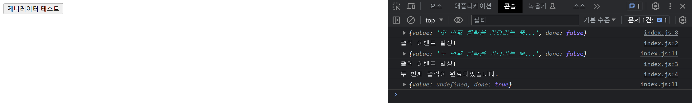

# JavaScript 제너레이터에 대해 알아보자

## Generator

제너레이터는 특별한 종류의 함수로서, 반복 가능한 구조를 만들 수 있다. 

제너레이터는 코드 실행을 중간에 멈추었다가 필요할 때 다시 시작할 수 있는 능력을 가지고 있다.

이 능력은 `yield`라는 특별한 키워드를 통해 구현되며, 이를 이용하면 다양한 방식으로 활용할 수 있다. 

## ****Iterator와 Iterable에 대한 이해****

### Iterable

제네레이터는 **이터레이터면서** **이터러블**이다.

********`iterable` :** 반복가능한 객체, 배열이나 문자열, `Map`, `Set` 도 기본적으로 `iterable`

- `Symbol.iterator`메서드를 가지고 있는 객체를 말한다.
- `Symbol.iterator` 를 호출하면 `iterator`를 반환해야 한다.

<aside>
❓ `for...of` 나 `spread` 문법도 `Iterable` 을 활용한 문법이다

</aside>

**`iterator`**

- `next` 메서드를 가지고 있는 객체를 말한다.
- `next` 메서드는 `value`와 `done` 속성을 가진 객체를 반환한다.
- `done` 속성은 모든 값을 다 순회했는지 나타내는 `boolean` 값이고 `value` 는 현재 위치의 값을 나타낸다.
- 작업이 끝나면 `done`은 `true`가 된다.

<aside>
❓ 배열도 `iterable` 이라면 `Symbol.iterator` 를 실행해서 `iteratort` 의 `next` 메서드 등을 쓸 수 있을까?
(* [Array.prototype](https://developer.mozilla.org/ko/docs/Web/JavaScript/Reference/Global_Objects/Array/@@iterator) 에는 `Symbol.iterator`가 존재한다.)

</aside>

```jsx
const arr = [1, 2, 3, 4, 5];

const iterator = arr[Symbol.iterator]();

iterator.next(); // {value: 1, done: false}
iterator.next(); // {value: 2, done: false}
iterator.next(); // {value: 3, done: false}
iterator.next(); // {value: 4, done: false}
iterator.next(); // {value: 5, done: false}
iterator.next(); // {value: undefined, done: true}
```

문자열도 똑같이 가능하다.

### 제너레이터

제너레이터는 `Iterator`와 `Iterable`을 생성하는 간단한 방법이다. 제너레이터 함수는 일반 함수의 이름앞에 `*` 기호를 붙이고, 함수 내부에서 `yield`키워드를 사용한다

```jsx
function* genFn() { // 함수에 *를 붙이면 제너레이터 함수
	console.log(1);
	yield "첫번째"; // yield에서 함수의 실행을 멈출 수 있다.
	console.log(2);
	yield "두번째";
	console.log(3);
	console.log(4);
	yield "마지막";

	return "함수 종료";
}
```

```jsx
const foo = genFn(); // 제너레이터 함수를 실행하면 제너레이터 객체를 반환한다.
console.log(foo) // genFn {<suspended>} <- 제너레이터 객체

const bar = foo.next(); // next를 호출하면 가장 까가운 yield문을 만날 때 까지 실행되고
// value와 done 프로퍼티를 가진 데이터 객체를 리턴한다.

console.log(bar)// {value: '첫번째', done: false}
```

## Generator의 메소드들

`next()` 메서드는 가장 많이 사용되는 메서드로, 제너레이터의 다음 `yield` 로 진행하거나 제너레이터의 실행을 시작한다. 인수를 선택적으로 받을 수 있고, 이 인수는 제너레이터 내부에서 `yield`의 결과로 사용됨

```jsx
function* generatorFunc() {
  const x = yield 'first';
  const y = yield (x + ' second');
  return x + y;
}

const gen = generatorFunc();

console.log(gen.next());  // { value: 'first', done: false }
console.log(gen.next('Hello'));  // { value: 'Hello second', done: false }
console.log(gen.next('World'));  // { value: 'HelloWorld', done: true }
```

`return()`

제너레이터를 종료하고 주어진 값을 반환값으로 사용한다. 호출 즉시 done의 값이 true가 된다.

```jsx
function* generatorFunc() {
  yield 'first';
  yield 'second';
}

const gen = generatorFunc();

console.log(gen.next());  // { value: 'first', done: false }
console.log(gen.return('end'));  // { value: 'end', done: true }
console.log(gen.next());  // { value: undefined, done: true }
```

`throw()`

제너레이터 내부에서 예외를 발생시킨다. 이 메서드에 전달된 인수는 제너레이터 내부에서 throw 키워드에 의해 발생한 예외로 간주된다.

```jsx
function* genFn() { // 함수에 *를 붙이면 제너레이터 함수
	try{
		console.log(1);
		yield "첫번째"; // yield에서 함수의 실행을 멈출 수 있다.
		console.log(2);
		yield "두번째";
		console.log(3);
		console.log(4);
		yield "마지막";

		return "함수 종료";
	} catch (e) {
		console.log(e);
	}
}
```

```jsx
const a = genFn(); 
a.next(); // 1이 콘솔에 찍히고, {value: '첫번째', done: false} 출력
a.throw(new Error('err')); // Error caught inside the generator: err, { value: undefined, done: true }
```

### `next()` 에 인수 전달하기

제너레이터는 외부로부터 값을 입력받을 수도 있다. 제너레이터의 `next` 메소드에 인수를 전달하면, 그 인수는 이전 yield 표현식의 결과로서 사용된다.

```jsx
function* genFn() {
	const num1 = yield "첫 번째 숫자를 입력해주세요.";
	console.log(num1);

	const num2 = yield "두 번째 숫자를 입력해주세요.";
	console.log(num2);

	return num1 + num2;
}
```

```jsx
const iter = genFn();

iter.next(); // {value: "첫 번째 숫자를 입력해주세요.", done: false}
iter.next(1); // {value: "두 번째 숫자를 입력해주세요.", done: false}
iter.next(2); // {value: 3, done: true}
```

### ****제너레이터와 메모리 효율성****

제너레이터는 필요한 값만을 즉시 생성함으로써 메모리 효율성을 높일 수 있다.

```jsx
function* genFn() {
	let count = 0;
	while (true) {
		yield index++;
	}
}
```

필요한 순간에만 연산해서 값을 주기때문에 위와 같은 무한반복되는 코드를 실행해도 브라우저가 먹통이 되지않음. (`next()`를 호출할때마다 값을 주기때문)

```jsx
const iter = genFn();
iter.next(); // {value: 0, done: false}
iter.next(); // {value: 1, done: false}
iter.next(); // {value: 2, done: false}
iter.next(); // {value: 3, done: false}
...
```

위의 예시가 와닿지 않을 수 도 있다. (나도 그랬음)

### 함수형 프로그래밍에서 Early Evaluation과 Lazy Evaluation의 성능 차이 비교

### **Lazy Evaluation**

```jsx
// Object.prototype에 함수들을 추가해서 모든 객체에서 접근 가능하도록 함
Object.prototype.lazyMap = lazyMap;
Object.prototype.take = take;

// lazyMap은 제너레이터 함수로서, 각 원소에 대해 주어진 콜백 함수를 적용함
function* lazyMap(callback) {
  // this는 lazyMap 함수를 호출하는 객체를 가리킴
  // 여기서는 배열 arr이 됨
  for(const el of this){
    yield callback(el);  // 콜백 함수를 적용한 값을 반환
  }
}

// take 함수는 제너레이터에서 n개의 원소를 가져옴
function take(n = Infinity){
  const result = [];

  // this는 take 함수를 호출하는 객체를 가리킴
  // 여기서는 lazyMap 함수가 반환한 제너레이터가 됨
  for(const el of this){
    result.push(el);

    // n개의 원소를 모두 가져오면 종료
    if(result.length === n) break;
  }

  return result;
}

// 콜백 함수 정의
function callback(element) {
  console.log('콜백 호출!');
  
  return element + 1;  // 원소에 1을 더한 값을 반환
}

// 크기가 10000인 배열 생성
const arr = Array(10000).fill(1);

// lazyMap 함수를 통해 콜백을 적용하고, 그 결과로 생성된 제너레이터에서 첫 2개의 원소를 가져옴
const mappedArr = arr.lazyMap(callback).take(2);

console.log(mappedArr);  // 콜백 함수가 적용된 첫 2개의 원소 출력
// 콜백 호출! x 2번
// [2, 2]
```

### **Early Evaluation**

10000번의 순회를 모두 진행

```jsx
const arr = Array(10000).fill(1);

const mappedArr = arr.map(callback).take(2);

console.log(mappedArr);

// 콜백 호출! x 10000번
// [2, 2]
```

## yield* ****키워드****

`yield*` 키워드는 다른 제너레이터 또는 이터러블 객체의 원소를 하나씩 생산한다.

```jsx
function* gen1() {
	yield "W";
	yield "o";
	yield "r";
	yield "l";
	yield "d";
}

function* gen2(){
	yield "Hello,";
	yield* gen1(); // 다른 제너레이터 함수 호출
	yield "!";
}
```

```jsx
console.log(...gen2()); // Hello, W o r l d !
```

** Spread 연산자는 `iterable`한 객체를 개별 요소로 분리하는데, 배열이나 String 같은 `iterable` 객체뿐만 아니라, 제너레이터 함수가 반환하는 `iterator`도 분리할 수 있다.

따라서 → `console.log(...gen2())` 이 코드는 `gen2()` 에서 생성된 `iterator`의 `next()` 를 계속 호출해서, 반환된 모든 값을 개별적으로 console.log에 전달하게 된다.

## 제너레이터 활용하기

### 이벤트 순서 제어

두 번의 클릭 이벤트가 순서대로 발생하는 것을 제너레이터를 통해 제어하는 코드 예시

```jsx
function* clickSequence() {
  console.log(yield '첫 번째 클릭을 기다리는 중...');
  console.log(yield '두 번째 클릭을 기다리는 중...');
  console.log('두 번째 클릭이 완료되었습니다.');
}

const gen = clickSequence();
console.log(gen.next());  // 제너레이터 시작

document.querySelector('#btn').addEventListener('click', () => {
  console.log(gen.next('클릭 이벤트 발생!'));
});
```



`btn` 이라는 `id` 를 가진 버튼이 클릭될 때마다 ‘클릭 이벤트 발생!’ 이라는 메세지와 함께 제너레이터의 `next()` 가 호출 된다. 이렇게 해서 두 번의 클릭 이벤트가 순서대로 발생하는 것을 제어할 수 있다.

### 비동기 요청 제어

`fetch` 를 사용해서 비동기 요청을 처리하는 경우, 비동기 작업의 순서를 제어하는 데 제너레이터를 사용하면, 비동기 작업이 완료될 때까지 기다린 후에 다음 작업을 실행하는 등의 제어가 가능해진다.

```jsx
function* fetchUserSequence() {
  const response = yield fetch('https://your.api.url');
  const data = yield response.json();
  console.log(data);
}

function runGenerator(genFn) {
  const iterator = genFn();
  function go(result) {
    if (result.done) return result.value;
    return Promise.resolve(result.value).then(function (res) {
      return go(it.next(res));
    }, function (err) {
      return go(it.throw(err));
    });
  }
  go(it.next());
}

runGenerator(fetchUserSequence);
```

위의 예시에서는 `fetchUserSequence` 제너레이터를 통해 api 주소로 비동기 요청을 보내고, 응답을 받아 처리하는 과정을 순서대로 제어하고 있다. `runGenerator` 함수는 제너레이터와 프로미스를 함께 사용해서 비동기 작업의 순서를 제어하는 역할을 한다. 

이 방법으로 비동기 요청과 그에 대한 응답처리를 순차적으로 할 수 있다.

<aside>
❓ 뭔가 async/await으로 할 수 있을 것 같다?

</aside>

위의 비동기 요청 코드를 async/await로 수정하면 아래처럼 간결하게 작성할 수 있다.

```jsx
async function fetchUserSequence() {
  const response = await fetch('https://your.api.url');
  const user = await response.json();
  console.log(user.name);
}

fetchUserSequence().catch(err => console.error(err));

// async/await로 수정하면 더 간결하게 작성할 수 있음.
```

**비동기 작업에 한해서**는 `async/await`는 `promise + generator`의 문법적 설탕이라고 볼 수도 있다.

(근데 제너레이터가 할 수 있는 다른 기능을 다 고려하면 아님)

## 🧐정리

자바스크립트에서는 비동기 작업을 처리하기 위한 여러 가지 도구를 제공한다. 이 중에서도 `Iterator`, `Generator`, `Promise`, 그리고 `async/await`는 중요한 개념들 이라고 생각한다.

1. **`Iterator와 Iterable`**: `Iterator`는 '반복 가능한' 객체의 요소를 탐색하기 위한 인터페이스다. `Iterable`은 `Symbol.iterator` 메서드를 통해 자신의 `Iterator`를 반환하는 객체를 말한다. 이들은 `for...of` 반복문 등을 통해 유용하게 사용될 수 있다.
2. **`Generator`**: `Generator`는 `Iterator`와 유사하지만, 함수의 실행을 일시 중지하고 재개하는 추가적인 기능을 가진다. **`yield`** 표현식을 통해 값을 생산하고, **`next`**, **`return`**, **`throw`** 등의 메서드를 통해 함수의 실행 흐름을 제어할 수 있다.
3. **`Promise`**: `Promise`는 비동기 작업의 최종 완료 또는 실패를 나타내는 객체다. `Promise`는 비동기 작업을 보다 효율적으로 처리하도록 도와준다.
4. **`Async/await`**: `Async/await`는 `Promise` 기반의 비동기 작업을 더 간결하고 가독성 높게 처리할 수 있도록 도와주는 문법, 비록 '제너레이터의 문법적 설탕'이라고 설명하기엔 한계가 있지만, `Promise`를 사용할 때의 복잡성을 줄여주는 역할을 한다.

 이런 도구들은 각기 다른 특성과 장단점이 있으니, 상황에 따라 잘 써먹어야 할 것 같다. **`Generator`**나 **`async/await`** 같은 도구들은 비동기 작업을 순서대로 처리하거나, 이벤트 발생 순서를 조절하는 등의 복잡한 상황에서 유용하게 써먹을 수 있을 것 같다는 생각이 든다. 

**`Generator`**를 제외한 다른 기술들은 이미 써봤지만, 내가 제대로 이해하고 활용하고 있는지에 대해선 항상 의문이었다. 이번에 이 주제를 학습하면서 기초를 좀 더 다질 수 있었다는 생각이 든다.

앞으로 기술을 쓸 때마다, 왜 이 기술을 써야 하는지 고민하는 개발자가 되어야겠다.