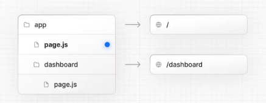

# Next 13 주요 변경점

Next.js에서 라우트를 처리하고 뷰를 렌더링하기 위해 새로운 전략을 내왔습니다.
기존의 `page`디렉토리를 대체하는 `app`디렉토리에는 어떤 변화가 있을까요?

## 1. 페이지와 레이아웃

Next13부터 `app`디렉토리 아래의 `page.jsx`를 통해 라우팅 경로를 지정할 수 있습니다.

`page.js`처럼 제공되는 많은 파일 규칙들이 있다.

이 중 중요한 것만 추려보면 다음과 같다.

1. `layout` : 세그먼트(변수) 및 하위에 대한 공유
2. `page` : 경로의 고유한 UI 및 공개적으로 접속가능
3. `loading` : loading시 UI
4. `not-found` : 경로를 찾을 수 없을 때 UI
5. `error` : 에러시 UI
6. `route` : Server-side API의 endpoint

## layout.js

이전 버전의 `_app`과 `_doucment`는 Next13의 root `layout.jsx`로 대체되었습니다. 레이아웃은 폴더마다 지정할 수 있으며, 상위디렉토리에서 하위디렉토리로 이동하며 레이아웃을 중첩시킨다.

만약, 레이아웃을 공유하고 싶지 않으면`()`를 통해 라우트별 레이아웃을 분리시킬 수 있고

다중의 루트를 가진 레이아웃으로 구조화 하고싶으면 최상위의 root `layout.js`을 제거하고 각각 작성하면 된다. 물론 이렇게 분리하면 `<html>` `<body>`태그를 각각의 루트 레이아웃에 추가해야한다.


## loading.js

로딩페이지를 지정하고 싶으면 아래와 같이 로딩파일을 만들면

아래와 같이 자동으로 Suspense에 할당이 됩니다.


### Streaming

스트리밍을 통해 HTML을 청크로 분할하여 서버에서 클라이언트로 점진적으로 전송할 수 있습니다.

스트리밍을 사용하면 아래와 같이 Hydrating 시간도 줄일 수 있고 FCP(First Contentful Paint)도 빠르게 할 수 있습니다.

예제를 보면 단순 React의 Suspense로 작동합니다.

```jsx
import { Suspense } from "react";
import { PostFeed, Weather } from "./Components";

export default function Posts() {
  return (
    <section>
      <Suspense fallback={<p>Loading feed...</p>}>
        <PostFeed />
      </Suspense>
      <Suspense fallback={<p>Loading weather...</p>}>
        <Weather />
      </Suspense>
    </section>
  );
}
```

### route.js

하단처럼 GET과 POST시 맵핑되도록 바뀌었습니다.

```js
//ex) /api/members/route.js
export async function GET(req) {
    ...

    return NextResponse.json(응답 값)
}

export async function POST() {
    ...
}

```

## 2. 하이브리드 애플리케이션

Next13부터 컴포넌트 별로 `"use server"`, `"use client"`를 명시하여 React가 ‘서버’에서 처리될 것인지, '클라이언트’에서 처리될 것인지 경계를 구분할 수 있습니다.

### 서버 렌더링 측면의 이점

1. **데이터 가져오기** : 필요한 데이터 요청-응답 시간을 감소시킬 수 있습니다. 렌더링에 필요한 데이터를 가까운 서버에서 가져오니 빠른 시간에 데이터를 가져올 수 있습니다.
2. **보안** : 토큰 및 API키와 같은 중요한 정보를 서버에 보관할 수 있습니다.
3. **캐싱** : 서버에서 랜더링 후 결과 페이지를 저장해놓았다가 다른 사용자가 같은 요청을 보냈을 때 재사용하여 보낼 수 있어 비용을 절감할 수 있습니다.
4. **번들크기** : 서버 구성요소를 사용하면 Javascript 번들 크기에 영향을 주었던 종속성 파일크기를 줄일 수 있습니다.
5. **FCP**(Initial Page Load and **F**irst **C**ontentful **P**aint): 서버에서 HTML을 생성해서 보여주므로 사용자가 페이지를 빠르게 볼 수 있습니다.
6. **검색엔진 최적화 및 소셜네트워크 공유성**: 생성된 HTML을 검색엔진 봇에 사용하여 페이지를 인덱싱할 수 있습니다.
7. **스트리밍**: 서버 구성요소를 사용해서 렌더링 작업을 청크로 분할하고 준비되는대로 클라이언트로 스트리밍을 할 수 있습니다.

### 서버 렌더링은 어떻게 될까?

간단하게 설명하자면

1. 클라이언트가 요청이 오면, 서버에서 HTML을 렌더링 후, 부족한 정보를 보충해줄 RSC`(React Server Components Payload)`라는 것을 묶어 보낸다. 이렇게 따로 보내면 사용자가 빠르게 볼 수 있다.
2. 하지만 HTML은 인터렉션이 불가능했다. RSC을 통해 인터렉션이 가능하게 만들어준다.

어렵게 설명하자면

1. React의 Api를 사용해서 렌더링되는데, 렌더링 작업은 개별 경로 세그먼트 및 서스펜스 경계별로 청크를 나눠서 진행한다.
2. 각 청크는 두 단계로 렌더링 된다.
   - React는 서버 구성 요소를 React Server 구성 요소 페이로드(RSC 페이로드)라는 특수 데이터 형식으로 렌더링합니다.
   - Next.js는 RSC 페이로드 및 클라이언트 구성 요소 JavaScript 지침을 사용하여 서버에서 HTML을 렌더링합니다.
3. 그런 다음 클라이언트에서 다음 작업을 수행합니다.
   - HTML은 초기 페이지 전용으로 non-interaction 즉 대화형이 아닙니다.
   - `React Server Components Payload`는 클라이언트 및 서버 구성 요소 트리를 조정하고 DOM을 업데이트하는 데 사용됩니다.
   - JavaScript 지시사항은 클라이언트 구성요소를 [hydrate](https://react.dev/reference/react-dom/client/hydrateRoot)시키고 응용프로그램을 대화형으로 만드는 데 사용됩니다.

> ### hydration에 대한 설명
>
> 개발자들은 Server Side 단에서 먼저 정적 페이지를 렌더링하고 JS파일들도 번들링한 후에 둘다 Client Side로 보내주는 생각을 해냈다. 하지만 그 DOM에는 동적인 이벤트가 하나도 없는 메마를 상태일 것이다. 그래서 이 메마른 뼈대에 수분을 보충해서, 즉 HTML 코드와 JS 코드를 서로 매칭시켜 동적인 웹사이트를 브라우저에 랜더링하는 기술이 등장했는데 이게 바로 **Hydratation**이다. 그래서 Hydration을 한글로 직역하면 수분 보충이라고 말 할 수 있다.
> [React의 Hydration에 대하여](https://velog.io/@huurray/React-Hydration-%EC%97%90-%EB%8C%80%ED%95%98%EC%97%AC)

### 정적 렌더링이 기본값이다.

Next13에서 동적인 데이터가 없으면 페이지가 자동으로 캐싱되어 정적페이지로 제공한다.
마치 next12에서 `getStaticProps`로 생성한 것과 같다.

### 동적 렌더링

Next 13에서는 data fetching시에 별도의 설정을 하지 않아도 캐싱을 자동으로 합니다.

서버 동적페이지 렌더링 즉 SSR 예제를 살펴봅시다.

```jsx
// app/todo/[todoId]/page.tsx
async function TodoId({ params: { todoId } }: Props) {
  const todo = await fetch(`https://example/${todoId}`, {
    cache: "force-cache",
  });

  return (
    <div>
      <div>Todo Id : {todoId}</div>
      <div>Todo Title : {todo.title}</div>
    </div>
  );
}
```

`todoId`에 따라 데이터를 패칭하게 됩니다. 데이터를 패칭할때 속성값으로 cache를 `force-cache`(기본값)으로 설정하면 데이터를 캐싱하게 됩니다. 이후 같은 요청이 오면 캐싱되어있는 데이터를 사용하여 정적 페이지를 제공할 수 있습니다.

```javascript
// 정적페이지 제공(저장된 페이지 사용)
fetch(URL, { cache: "force-cache" });

// 동적페이지 제공(매번 재 렌더링)
fetch(URL, { cache: "no-store" });
```

또는 fetch리소스의 캐시 수명을 설정할 수 있습니다.

```javascript
fetch("https://...", { next: { revalidate: 3600 } });
```

이렇게 데이터를 캐싱하면 [Dynamic Function](https://nextjs.org/docs/app/building-your-application/rendering/server-components#dynamic-functions)을 만나지 않는 한 정적사이트로 제공해주게 됩니다.


하지만, 동적 데이터를 미리 실행해두면 정적페이지로 제공할 수 있겠죠?

### **[generateStaticParams\(정적 매개 변수 생성\)](https://nextjs.org/docs/app/api-reference/functions/generate-static-params)**

빌드시 generateStaticParams가 실행되어 정적 매개 변수를 생성할 수 있습니다.

```jsx
// app/message/[message]/page.js

// Return a list of `params` to populate the [slug] dynamic segment
export async function generateStaticParams() {
  const posts = await fetch("https://.../posts").then((res) => res.json());

  return posts.map((post) => ({
    slug: post.slug,
  }));
}

// Multiple versions of this page will be statically generated
// using the `params` returned by `generateStaticParams`
export default function Page({ params }) {
  const { slug } = params;
  // ...
}
```

```jsx
// app/products/[products]/[product]/page.tsx
export function generateStaticParams() {
  return [
    { category: "a", product: "1" },
    { category: "b", product: "2" },
    { category: "c", product: "3" },
  ];
}

// Three versions of this page will be statically generated
// using the `params` returned by `generateStaticParams`
// - /products/a/1
// - /products/b/2
// - /products/c/3
export default function Page({
  params,
}: {
  params: { category: string, product: string },
}) {
  const { category, product } = params;
  // ...
}
```

## 클라이언트 컴포넌트

`“use client”`를 파일 맨 위에 명시해주면 클라이언트에서 동작하는 컴포넌트로 지정 가능합니다.
다만. 클라이언트 컴포넌트 아래에 있는 컴포넌트들은 전부 클라이언트에서 동작하게 됩니다.

```jsx
"use client";

import { useState } from "react";

export default function Counter() {
  const [count, setCount] = useState(0);

  return (
    <div>
      <p>You clicked {count} times</p>
      <button onClick={() => setCount(count + 1)}>Click me</button>
    </div>
  );
}
```

클라이언트 컴포넌트 아래에 서버를 넣는 패턴에 대해서는 아래에 자세히 설명되어 있습니다.
[\[next13\] Server components](https://velog.io/@deli-ght/next13-Server-components)
[Rendering: Composition Patterns](https://nextjs.org/docs/app/building-your-application/rendering/composition-patterns)

# 결론

이와같이 Next13은 하이브리드 어플리케이션을 지원하여 페이지단위를 넘어 컴포넌트 단위로 렌더링 전략을 구사할 수 있게 되었습니다.

# Reference

- [Rendering: Server Components](https://nextjs.org/docs/app/building-your-application/rendering/server-components#dynamic-functions)
- [\[next13\] Server components](https://velog.io/@deli-ght/next13-Server-components)
- [Next.js 12 vs Next.js 13: What’s the Difference?](https://www.descope.com/blog/post/nextjs12-vs-nextjs13)
- https://velog.io/@huurray/React-Hydration-%EC%97%90-%EB%8C%80%ED%95%98%EC%97%AC
- https://velog.io/@jay/Next.js-13-master-course-Static-Dynamic-Rendering
- [Server component vs. Client Component](https://velog.io/@timosean/Server-component-vs.-Client-Component)
