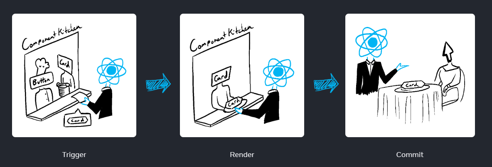
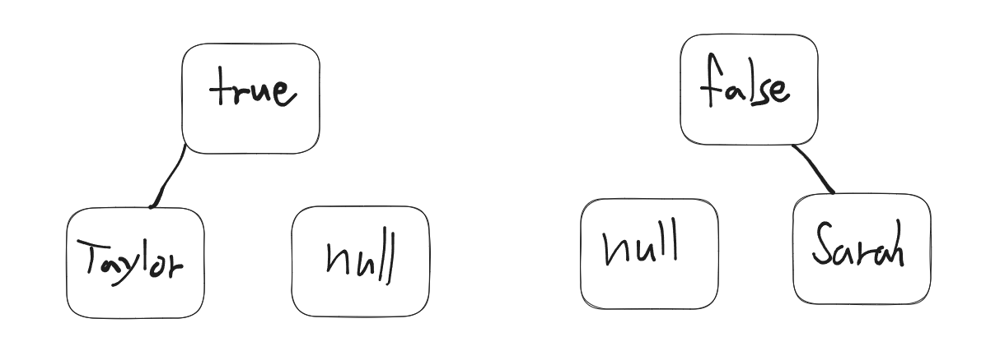
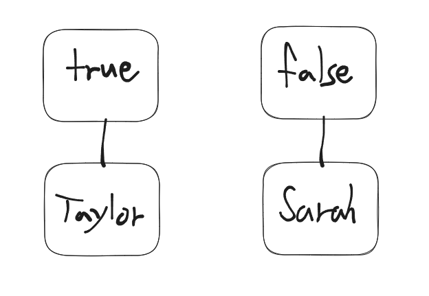

# key

## 들어가며..

리액트를 공부하며 수많은 튜토리얼 영상과 블로그를 접해봤을텐데, 대부분 `<ul>` 안에서 여러  `<li>`를 생성하거나 컴포넌트를 만들 때, `map`함수를 사용하면서 꼭 `key`속성을 넣어줘야 한다고 강조하는 것을 봤을 것이다. 그리고 여기서 흔히 언급 되는 것 중 하나가 `key`는 그 배열의 `index`를 사용하면 안된다는 것, 하지만 때론 그 UI가 고정적이라면 `index`를 써도 괜찮다는 주장도 있다.


"그럼 왜 `key`는 중요한걸까? 어떤 경우에 `index`를 사용하면 안 되는 걸까?" 이런 궁금증을 가지고 있다면, 바로 이 포스팅에서 그 해답을 함께 찾아보도록하자. 그 전에 리액트의 렌더링 방식에 대한 배경 지식을 학습하면서, 뒷 내용을 더 쉽게 이해할 준비운동을 해보자.

## 렌더링이란?

렌더링이란 웹 페이지에 정보를 표시하는 과정을 말한다. 여기서 주의해야 할 점은, **리액트의 렌더링과 브라우저의 렌더링은 다른 의미**를 가진다는 것이다. 브라우저 렌더링은 `HTML`, `CSS`, 자바스크립트 등을 처리해서 화면에 내용을 그려내는 전체 과정을 의미한다. 반면, 리액트의 렌더링은 `가상 DOM`을 사용해 `UI`를 업데이트하는 과정을 지칭한다.

### `가상 DOM`이란?

리액트는 효율적인 `UI` 업데이트를 위해 `가상 DOM`을 사용한다. `가상 DOM`은 메모리 상에 존재하는 `실제 DOM`의 표현 형태다. 컴포넌트의 `state`나 `props`가 변하면, 리액트는 새로운 `가상 DOM`을 생성한다. 그리고 `실제 DOM`과 `가상 DOM`을 비교해 차이점을 파악하고(재조정 과정), `실제 DOM`을 해당 부분만 업데이트한다.

### 왜 `가상 DOM`을 사용하는가?

직접 `DOM`을 조작하는 것은 상대적으로 느리고 비효율적이다. 특히 웹 애플리케이션에서 자주 일어나는 `UI` 업데이트 때문에 성능 저하가 큰 문제가 될 수 있다. `가상 DOM`을 사용하면, 리액트는 필요한 부분만 `실제 DOM`에 반영해 성능을 최적화한다.

### `Triggering`, `Rendering` 그리고 `Committing`



[공식문서](https://react.dev/learn/render-and-commit#)의 내용을 기반으로 설명하면

### Step 1: 렌더링 요청 (`Trigger`)

웨이터가 주방으로 주문을 전달하는 과정과 같다. 주로 두 가지 경우가 이 단계를 시작한다.

1. 컴포넌트의 초기 렌더링
2. 컴포넌트의 상태가 업데이트 되었을 때

### Step 2: 컴포넌트 렌더링 (`Render`)

이 단계 에서는 주방장(컴포넌트)이 주문된 요리(`UI`)를 준비하는 과정이다.

- 리액트가 컴포넌트를 호출하여 화면에 어떤 내용을 표시할시 결정한다.
- 초기 렌더링시에는 루트 컴포넌트를 호출한다.
- 상태 업데이트로 인한 렌더링에선느 해당 상태 변경을 유발한 컴포넌트를 호출한다.
- 이 과정은 재귀적으로 진행된다. 컴포넌트 내부에서 다른 컴포넌트를 반환하면, 그 컴포넌트도 또 다시 렌더링된다. 이 과정은 더 이상 내부 컴포넌트가 없을 때까지 계속된다.

### Step 3: `DOM`에 반영 (`Commit`)

이 단계는 준비된 요리(`UI`)를 손님에게 제공하는 과정과 같다.

- 리액트는 `Render` 단계에서 얻은 결과를 실제 `DOM`에 반영한다.
- 이 과정은 비동기적으로 진행되며, 효과적인 방식으로 `UI` 업데이트를 최적화한다.

라고 설명되어 있다. 그렇다면 이제 우리가 흔히 듣는 `리렌더링` 이라는 용어는 무엇을 의마하는 걸까? 그리고 왜 이 리렌더링에 많은 관심을 가지고 최적화에 힘쓰는 걸까?

## 리렌더링

리렌더링은 컴포넌트의 데이터나 상태의 변화가 발생했을 때 `UI`를 재구성하는 과정을 의미한다. 예컨대, 사용자의 행동에 반응하여 `state`가 변화하거나, 부모 컴포넌트에서 새로운 `props`를 전달받게 되면 해당 컴포넌트는 리렌더링 과정을 거친다.

### 리렌더링 최적화

리액트에서는 상위 컴포넌트가 리렌더링 되면 그 자식 컴포넌트들도 기본적으로 리렌더링 된다. 그 이유는 상위 컴포넌트의 `context`나 `props`의 변경이 자식 컴포넌트에 영향을 줄 수 있기 때문이다.

<iframe src="[https://codesandbox.io/embed/modest-jackson-sxltyq?fontsize=14&amp;hidenavigation=1&amp;theme=dark](https://codesandbox.io/embed/modest-jackson-sxltyq?fontsize=14&amp;hidenavigation=1&amp;theme=dark)" width="100%" height="350"></iframe>

위의 예제에서 `App` 컴포넌트의 `count` 상태가 변경될 때 마다 `ChildComponent`가 불필요하게 재렌더링된다. 그 이유는 `data` 객체와 `handleClick` 함수가 매번 새로운 참조로 생성되기 때문이다. (`props`로 객체나 함수를 넘길 때 문제가 많이 생긴다.)

위 예제를 최적화 해보자.

### 1\. `React.memo` 사용

`React.memo`를 사용하면 컴포넌트가 불필요하게 재렌더링되는 것을 방지할 수 있다.

```
const ChildComponent = React.memo(({ data, onClick }) => {
  console.log('ChildComponent rendered');
  return (
    // ...
  );
});

// 혹은 사용하는 곳에서
import ChildComponent from "경로"

const MemoChildComponent = React.memo(ChildComponent);
export default App() => {
	//...
    return (
    <div>
      <MemoChildComponent ..../>
    </div>
    )
}

```

### 2\. `useMemo`와 `useCallback` 훅 사용

`useMemo`와 `useCallback` 훅을 사용해서 방지할 수 있다.

```
export default function App() {
  const [count, setCount] = useState(0);

  const handleClick = useCallback(() => { // useCallback
    setCount(prevCount => prevCount + 1);
  }, []);

  const data = useMemo(() => ({ name: 'John' }), []); // useMemo

  return (
    <div>
      <ChildComponent data={data} onClick={handleClick} />
      <p>Count: {count}</p>
    </div>
  );
}

```

<iframe src="[https://codesandbox.io/embed/gracious-morning-2gchrh?fontsize=14&amp;hidenavigation=1&amp;theme=dark](https://codesandbox.io/embed/gracious-morning-2gchrh?fontsize=14&amp;hidenavigation=1&amp;theme=dark)" width="100%" height="350"></iframe>

위와 같이 `useMemo`와 `useCallback`을 사용하면 `data` 객체와 `handleClick` 함수는 해당 의존성 배열에 명시된 값들이 변경되지 않는 한 재생성되지 않는다. 따라서 불필요한 재렌더링을 방지할 수 있다.

> 하지만 여기서 주의해야 할 점은 "리렌더링"과 "DOM 업데이트"는 다르다는 것이다.
> 
> 
> 리렌더링이 되더라도 실제로 변경된 내용이 없다면 DOM 은 업데이트 되지않는다.
> 

최적화를 할 때는 반드시 필요한 상황에서만 진행해야 한다. 때로는 최적화를 과도하게 적용하면 코드의 복잡성이 높아지고, 디버깅이 어려워질 수 있다. 실제로 성능 문제가 발생한 경우, 그 원인을 파악한 후에 적절한 최적화 기법을 선택하는 것이 중요하다. 모든 상황에서 무작정 최적화를 시도하는 것은 비효율적이며, 때로는 오히려 성능을 떨어뜨릴 수도 있다.

[모든 곳에 memo를 추가해야할까요?](https://react-ko.dev/reference/react/memo#should-you-add-memo-everywhere)

## 재조정(`Reconciliation`)과 `key`

지금까지 우리는 리액트의 렌더링 방식에 대해 알아보았다.(보다 자세하고 정확한 설명은 공식문서) "이렇게 까지 알아야 할 필요가 있나?" 라는 생각을 가질 수도 있지만. 사실 `key` 의 중요성을 제대로 이해하기 위해서는 이런 배경 지식이 필요하다고 생각했다.

### 재조정이란?

재조정은 리액트의 렌더링 방식의 핵심 부분이다. 이것은 `React`가 `DOM` 업데이트를 효율적으로 수행하기 위해 내부적으로 수행하는 과정이다. 실제로, 리액트는 트리의 변화를 감지하고 그 변화를 최소한으로 효율적으로 `DOM`에 반영하기 위해 이 과정을 수행한다.

### 재조정이 일어나는 경우

### 요소의 타입이 변경될 때

리렌더링이 일어난 후 `<div>` 에서 `<section>`으로 변경되는 경우처럼 요소의 타입이 바뀌면, `React`는 해당 부분의 `DOM` 트리를 완전히 새로 만든다.

<iframe src="[https://codesandbox.io/embed/dawn-grass-meowu5?fontsize=14&amp;hidenavigation=1&amp;theme=dark](https://codesandbox.io/embed/dawn-grass-meowu5?fontsize=14&amp;hidenavigation=1&amp;theme=dark)" width="100%" height="350"></iframe>

위 코드에서 이 부분을 보면

```
	{isFancy ? (
        <div>
          <Counter isFancy={true} />
        </div>
      ) : (
        <section>
          <Counter isFancy={false} />
        </section>
      )}

```

`Use fancy styling` 체크 박스를 누르면 `isFancy` 상태값이 토글되고 그에따라 `<div>` 에서 `<section>` 으로 바뀌는 모습을 볼 수 있다.

### DOM 요소의 위치가 변경될 때

<iframe src="[https://codesandbox.io/embed/cool-meadow-4ck92j?fontsize=14&amp;hidenavigation=1&amp;theme=dark](https://codesandbox.io/embed/cool-meadow-4ck92j?fontsize=14&amp;hidenavigation=1&amp;theme=dark)" width="100%" height="350"></iframe>

```
// 1)
{isPlayerA &&
  <Counter person="Taylor" />
}
{!isPlayerA &&
  <Counter person="Sarah" />
}

// 2)
{ isPlayerA ? <Counter person="Taylor" /> : <Counter person="Sarah" /> }

```

위 두 코드는 논리적으로 같지만, 완전히 다른 결과를 보여준다.

**1번 코드**는 `isPlayerA`가 `true` 일 때 "Taylor" 를 위한 `Counter` 컴포넌트를 렌더링 하고, `false` 일 때는 "Sarah"를 위한 다른 `Counter` 컴포넌트를 렌더링한다. 이 경우 `React`는 두 개의 다른 컴포넌트 인스턴스를 생성하고 렌더링한다. (위치가 다르기 때문)



**2번 코드**는 삼항 연산자를 사용해서 **동일한 위치**에 표시한다. 이렇게 되면 리액트는 person prop이 변경된 동일한 Counter로 간주한다. 그래서 재조정도 일어나지 않고 동일한 컴포넌트로 인식하기 때문에 counter 점수가 보존된다.



이 차이 때문에 `Counter` 내부의 상태를 1번 코드는 각각 가지는 반면에, 2번 코드는 상태를 인스턴스 간에 전환하려고 할 수 있다. 이로 인해 예기치 않은 동작이 발생할 수 있다.

### `key`를 이용한 해결

리스트나 조건부 렌더링에서 동일한 컴포넌트의 여러 인스턴스를 관리할 때는 `key` 속성을 사용해서 각 인스턴스를 명확하게 식별하는 것이 중요하다. `key` 를 제대로 사용하지 않으면 `React`의 재조정 메커니즘이 올바르지 않게 동작할 수 있다.

<iframe src="[https://codesandbox.io/embed/little-framework-vlg047?fontsize=14&amp;hidenavigation=1&amp;theme=dark](https://codesandbox.io/embed/little-framework-vlg047?fontsize=14&amp;hidenavigation=1&amp;theme=dark)" width="100%" height="350"></iframe>

똑같이 삼항 연산자를 이용했지만 `key` 속성을 사용해서 `React`가 컴포넌트를 구분할 수 있도록 해주었더니 `state`가 재조정 되는 걸 볼 수 있다.

🤔 왜 일까?

기본적으로 리액트는 부모 내의 **순서(위치) 를 사용해서 컴포넌트를 구분**한다. ("첫 번째 `Counter`", "두 번째 `Counter`") 하지만 `key`를 사용하면 이게 첫 번째 `Counter`가 아니라 특정(`Taylor`의 `Counter`) `Counter` 임을 리액트에게 알릴 수 있다. 이렇게 하면 리액트는 테일러의 `Counter`가 어디에 나타나든 알 수 있다.

## 추가적인 개념 `Fiber`

리액트 16부터 재조정(`Reconciliation`) 알고리즘의 새로운 구현체로 등장했다. `React Fiber`는 작업을 미세하게 분할해서 주 스레드에서 실행될 수 있는 단위로 나눌 수 있도록 해준다. 이를 통해 `React`는 렌더링 작업을 중단하고 어쩌구 필요에 따라 브라우저와 상호 작용하는 저쩌구

암튼 얘가 도입되고 나서부터 비동기 렌더링이랑 다른 기능들이 크게 향상 되었다고 한다.

`Fiber` 아키텍처 관점에서 봤을 때, `Fiber` 노드에는 해당 컴포넌트와 관련된 여러 정보가 있고, `key`도 그 중 하나다. 리액트의 재조정 과정에서, `key`는 기존 `Fiber` 트리와 새 `Fiber` 트리 사이의 노드를 비교하는 데 도움을 준다. 쉽게 말하면 그냥 **`key` 덕분에 `React`가 변경된 항목을 쉽게 알 수 있다** 는 것이다.

### `Fiber Node`가 가지는 정보

1. `type`과 `key`: 컴포넌트 타입 (예: `div`, `li`) 및 `key`를 식별
2. `props`: 부모로부터 전달받은 속성 값
3. `state`: 컴포넌트의 현재 상태
4. `effect`: 부수 효과 목록 (예: 생명주기 메서드나 `hooks`의 효과)
5. `child`, `sibling`, `return`: 해당 노드의 자식, 형제, 부모 노드에 대한 참조
6. 등등

대충 이런 형태가 아닐까 싶다

```
{
  type: 'CommentList',
  child: {
    type: 'div',
    child: {
      type: 'Comment',
      key: 'A',
      props: { text: 'comment1_text' },
      sibling: {
        type: 'Comment',
        key: 'B',
        props: { text: 'comment2_text' },
        sibling: {
          type: 'Comment',
          key: 'C',
          props: { text: 'comment3_text' }
        }
      }
    }
  }
}

```

### 그렇다면 왜 고유한 값으로 `key`를 지정해야 하는지와 왜 `index`를 `key`로 사용하지 않는 것이 좋은지 눈으로 확인해보자. ([key 의 규칙](https://react-ko.dev/learn/rendering-lists#rules-of-keys))

### `index`를 `key`로 사용한 경우

<iframe src="[https://codesandbox.io/embed/happy-vaughan-ltrgtw?fontsize=14&amp;hidenavigation=1&amp;theme=dark](https://codesandbox.io/embed/happy-vaughan-ltrgtw?fontsize=14&amp;hidenavigation=1&amp;theme=dark)" width="100%" height="350"></iframe>

여기서 `React`에 있는 `Expand` 버튼을 누르고 `Hello`를 삭제해보자.

1\. 초기 상태

```
CommentList Fiber
│
├─ Comment Fiber (key='0', text="Hello", state: { liked: true, expanded: false })
│
├─ Comment Fiber (key='1', text="React", state: { liked: true, expanded: false })
│
└─ Comment Fiber (key='2', text="World", state: { liked: true, expanded: false })

```

2\. `React` 의 `expand` 버튼을 눌렀을 때

```
CommentList Fiber
│
├─ Comment Fiber (key='0', text="Hello", state: { liked: true, expanded: false })
│
├─ Comment Fiber (key='1', text="React", state: { liked: true, expanded: true })
│
└─ Comment Fiber (key='2', text="World", state: { liked: true, expanded: false })

```

3\. `Hello`를 삭제했을 때, `index`를 `key`로 사용했다면?

```
CommentList Fiber
│  // 원래 key는 1 이었음
├─ Comment Fiber (key='0', text="React", state: { liked: true, expanded: ??? })
│  // World의 원래 key는 2 였음
└─ Comment Fiber (key='1', text="World", state: { liked: true, expanded: ??? })

```

이 과정에서 상태를 잘못추적하고 꼬이게 될 수 있다. 원래 `React`는 `expanded: true` 상태 였는데, `index`를 `key`로 사용하면서 `React Fiber`는 이전 `Hello`의 상태(`expanded: false`)를 `React`에 재사용하려고 시도할 수 있다. 그 결과 `React`는 원래 0의 `key`를 가지고 있던 `Hello`의 `false` 값을 받게 되고, `World`는(2 -> 1) `React`(원래 1)의 `true` 값을 받게 된다.

### 반면, 고유한 값을 `key`로 사용하면

<iframe src="[https://codesandbox.io/embed/relaxed-poincare-ss4r9q?fontsize=14&amp;hidenavigation=1&amp;theme=dark](https://codesandbox.io/embed/relaxed-poincare-ss4r9q?fontsize=14&amp;hidenavigation=1&amp;theme=dark)" width="100%" height="350"></iframe>

1\. 초기 상태

```
CommentList Fiber
│
├─ Comment Fiber (key='0', text="Hello", state: { liked: true, expanded: false })
│
├─ Comment Fiber (key='1', text="React", state: { liked: true, expanded: true })
│
└─ Comment Fiber (key='2', text="World", state: { liked: true, expanded: false })

```

2\. `Hello` 삭제

```
CommentList Fiber
│
├─ Comment Fiber (key='1', text="React", state: { liked: true, expanded: true })
│
└─ Comment Fiber (key='2', text="World", state: { liked: true, expanded: false })

```

리액트가 `key`를 보고 올바르게 추적할 수 있어서 예기치 않은 상태 재사용 문제를 피할 수 있다.

## 마치며

제목은 `key`가 메인이었지만 쓰다보니 다른 내용을 더 많이 쓴 것 같다. 실제로 이게 어떻게 작동하는지 이해하려고 하니까 리액트의 렌더링 방식도 알아야 이해가 되는 것 같았다.. 이번 포스팅을 작성하면서 `key`를 왜 쓰는지 조금 더 깊게 이해할 수 있었다.

항상 틀린 부분이나 미흡한 부분이 있다면 알려주시면 감사x100 하겠습니다!

## 참고자료

[리스트와 Key – React (reactjs.org)](https://ko.legacy.reactjs.org/docs/lists-and-keys.html)

[Rendering Lists – React](https://react.dev/learn/rendering-lists)

[렌더링하고 커밋하기 – React (react-ko.dev)](https://react-ko.dev/learn/render-and-commit)

[\[10분 테코톡\] 솔로스타의 React 렌더링 - YouTube](https://www.youtube.com/watch?v=eBDj0B0HbEQ)