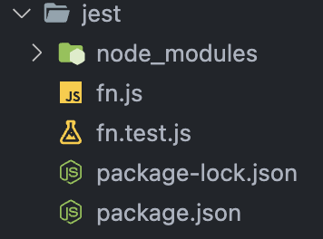

# Jest 1

# 시작하기

```
npm init
npm install jest --save-dev
```

### Package.json 세팅

scripts의 test를 jest로 바꿔준다.

```
{
  ...
  "scripts": {
    "test": "jest"
  },
}
```

### 테스트에 사용할 프로젝트의 구조를 이렇게 했다.

# 정수테스트

테스트를 위해 테스트할 함수파일(`fn.js`)와 테스트코드를 작성할 파일(`fn.test.js`)를 생성한다.
파일명은 `__test__` 또는 `test.js`로 끝나면 자동으로 인식하므로 선택하면 된다.


## 테스트를 위한 함수 작성

테스트 할 함수를 작성한다.
**fn.js**

```js
const fn = { add: (n1, n2) => n1 + n2 };
module.exports = fn;
```

## 테스트 코드를 작성한다.

테스트 코드의 구성은 다음과 같은데, `test()`의 함수 속에서 일어나는 것을 테스트 케이스라고 한다.
여러개의 `test()`를 구성할 수 있다.
`expect()`에는 기존 값을 넣고, `toBe()`에는 결과 값을 넣는다. 기존 값이 결과 값으로 나오면 ‘성공’ 다른 값이 나오면 ‘실패’하게 된다.
**테스트 함수의 구조**

```js
const 테스트함수 = () => {
  // 테스트에 사용할 콜백함수
  expect(기존값).toBe(미래값);
};
test("테스트시 출력할 문자열", 테스트함수);
```

**fn.test.js**
성공할 함수 2개와 실패할 함수 1개를 쓰면 아래처럼 된다.

```js
const fn = require("./fn"); // 검증할 함수를 불러온다.

test("1은 1이야", () => {
  expect(1).toBe(1); // 검증할 값 -> 결과
});

test("2더하기 3은 5야", () => {
  // 성공할 테스트 케이스
  expect(fn.add(2, 3)).toBe(5);
});

test("3더하기 3은 5야", () => {
  // 실패할 테스트 케이스
  expect(fn.add(3, 3)).toBe(5);
});
```

## 테스트 실행

**디렉토리 전체 테스트**
디렉토리를 순회하면서 test파일을 전부 실행시킨다.

```
npm test
```

한가지 파일만 실행하려면 아래처럼 작성하면 된다.

```
npm test 파일명
```

### 실행 결과

아래처럼 test 성공은 체크 표시로, 실패는 x표시가 뜨며, 실패한 위치를 보여준다.

```
npm test

jest@1.0.0 test
jest

 FAIL  ./fn.test.js
  √ 1은 1이야 (2 ms)
  √ 2더하기 3은 5야
  × 3더하기 3은 5야 (2 ms)

  ● 3더하기 3은 5야

    expect(received).toBe(expected) // Object.is equality

    Expected: 5
    Received: 6

      10 |
      11 | test("3더하기 3은 5야", () => {
	 >12 |   expect(fn.add(3, 3)).toBe(5);
		 |                        ^
	  13 | });
	  14 |
	  15 |

      at Object.toBe (fn.test.js:12:24)

Test Suites: 1 failed, 1 total
Tests:       1 failed, 2 passed, 3 total
Snapshots:   0 total
Time:        0.802 s
Ran all test suites.
```

# 함수 종류

## .not

toBe부분 앞에서 not을 표현하기 위해 쓴다.

```js
test("3더하기 3은 5가 아니야", () => {
  expect(fn.add(3, 3)).not.toBe(5);
});
```

## toEqual

객체의 값을 비교할 때 사용한다.
`toBe`를 쓰게되면 객체의 주소값으로 판단하여 실패하게 된다.

**fn.test.js**

```js
const fn = require("./fn");

test("이름과 나이로 객체를 생성", () => {
  expect({ name: "heisje", age: 30 }).toBe({ name: "heisje", age: 30 });
});

test("이름과 나이로 객체를 생성", () => {
  expect({ name: "heisje", age: 30 }).toEqual({ name: "heisje", age: 30 });
});
```

**테스트 결과**
If it should pass with deep equality, replace "toBe" with "toStrictEqual"
라는 문구와 함께 실패하게 된다.

```
 FAIL  ./fn.test.js
  ✕ 이름과 나이로 객체를 생성 (3 ms)
  ✓ 이름과 나이로 객체를 생성

  ● 이름과 나이로 객체를 생성

    expect(received).toBe(expected) // Object.is equality

    If it should pass with deep equality, replace "toBe" with "toStrictEqual"

    Expected: {"age": 30, "name": "heisje"}
    Received: serializes to the same string

      2 |
      3 | test("이름과 나이로 객체를 생성", () => {
    > 4 |       expect({ name: "heisje", age: 30, }).toBe({ name: "heisje", age: 30, });
        |                                            ^
      5 | });
      6 |
      7 | test("이름과 나이로 객체를 생성", () => {

      at Object.toBe (fn.test.js:4:39)

Test Suites: 1 failed, 1 total
Tests:       1 failed, 1 passed, 2 total
Snapshots:   0 total
Time:        0.198 s, estimated 1 s
Ran all test suites.
```

## toStrictEqual

undefined인 항목까지도 체크 가능하다.

```js
// toStrictEqual 실패
test("이름과 나이로 객체를 생성", () => {
  expect({ name: "heisje", age: 30, gender: undefined }).toStrictEqual({
    name: "heisje",
    age: 30,
  });
});

// toEqual 성공
test("이름과 나이로 객체를 생성", () => {
  expect({ name: "heisje", age: 30, gender: undefined }).toEqual({
    name: "heisje",
    age: 30,
  });
});
```

# 명령어 종류

이름에서 직역가능한 것은 따로 적지 않았다.

### Common Matchers

toBe
toBeCloseTo
소숫점이 근사값으로 같은지 (ex. 0.1+0.2 = 0.300000004이 되어 toBe로 확인할 수 없다.)
toEqual
toBeNull
toBeUndefined
toBeDefined

### bool값 판별

toBeTruthy
toBeFalsy

### <, <=, >, >=

toBeGreaterThan
toBeGreaterThanOrEqual
toBeLessThan
toBeLessThanOrEqual

# 문자열

### toMatch

`toMatch`에 정규 표현식을 넣으면 되고, 정규표현 식 뒤 `i`를 통해 대소문자 구분을 없애줄 수 있다.

```js
test("Heisje에 e라는 글자가 있나?", () => {
  expect("Heisje").toMatch(/e/);
});

test("Heisje에 h라는 글자가 대소문자 구분하지 않고 있나?", () => {
  expect("Heisje").toMatch(/h/i);
});
```

# 배열

### toContain

배열 요소인지 판단

```js
test("유저 리스트에 Heeje가 있나?", () => {
  const user = "Heeje";
  const userList = ["Tom", "Mike", "Heeje"];
  expect(userList).toContain(user);
});
```

# 에러반환

### toThrow

에러반환이 성공적으로 됐는지 판단한다.
`toThrow`에 인자가 없으면 에러 반환만 확인하고, 인자가 있으면 에러의 값이 같은지도 비교한다.

```js
const fn = {
  throwErr: () => {
    throw new Error("xx");
  },
};

test("에러 반환 테스트", () => {
  // 성공
  expect(() => fn.throwErr()).toThrow();
});

test("에러 반환 테스트", () => {
  // 실패
  expect(() => fn.throwErr()).toThrow("oo");
});
```

# Jest 2 비동기

# 비동기 함수 테스트

비동기 함수 3가지
콜백, promise, async await를 테스트 하기위해 setTimeout을 사용해 비동기적으로 데이터를 반환하고 테스트 해보자.

# 콜백

콜백 패턴을 가지고 있는 비동기 함수의 테스트 코드를 작성하는 법을 알아보자

**테스트 대상 함수 작성**

```js
getName: (callback) => {
    // 콜백 함수를 3초뒤에 실행시키는 함수
    const name = "Mike";
    setTimeout(() => {
      callback(name);
    }, 3000);
  },
```

**테스트 코드 작성**
기존 테스트 코드와 다른 점은 `done`을 작성해줘야 테스트가 정상적으로 종료되는 것이다.

```js
test("3초 후에 받아온 이름은 Mike done", (done) => {
  function callback2(name) {
    expect(name).toBe("Mike");
    done();
  }
  fn.getName(callback2);
});
```

**테스트 코드 try catch**

```js
test("3초 후에 받아온 이름은 Mike done", (done) => {
  function callback(name) {
    try {
      expect(name).toBe("Mike");
      done();
    } catch (error) {
      done();
    }
  }
  fn.getNameErr(callback);
});
```

---

## 콜백 패턴 주의사항

```js
test("3초 후에 받아온 이름은 Tom", () => {
  function callback1(name) {
    expect(name).toBe("Tom");
  }
  fn.getName(callback1); // jest는 실행이 끝에 도달하게되면 테스트가 끝나게 된다. 그래서 비동기 호출을 기다리지 않고 종료되었다.
});
```

**결과코드**
아래와 같이 1ms만에 성공으로 통과된다. 왜냐하면 jest는 실행이 끝에 도달하게되면 테스트가 끝나게 된다. 그래서 비동기 호출을 기다리지 않고 종료되었다.
그리하야 done을 써줘야 된다.

```
 PASS  ./fn.test.js
  ✓ 3초 후에 받아온 이름은 Mike done (3006 ms)
  ✓ 3초 후에 받아온 이름은 Tom (1 ms)

...
Ran all test suites.
Jest did not exit one second after the test run has completed.

'This usually means that there are asynchronous operations that weren't stopped in your tests. Consider running Jest with `--detectOpenHandles` to troubleshoot this issue.
/Users/home/Documents/sw/jest/node_modules/expect/build/index.js:314
      throw error;
      ^

JestAssertionError: expect(received).toBe(expected) // Object.is equality

Expected: "Tom"
Received: "Mike"
    ...

Node.js v20.5.0
```

---

# Promise

프로미스 패턴은 프로미스 객체를 주고 받기 때문에 실용성이 좋다.
**테스트 대상 함수**

```js
const fn = {
  // 프로미스 객체를 성공으로 반환시키는 경우
  getNamePromise: () => {
    const name = "Mike";
    return new Promise((res, rej) => {
      setTimeout(() => {
        res(name);
      }, 3000);
    });
  },

  // 실패로 반환시키는 경우
  getNamePromiseRejects: () => {
    return new Promise((res, rej) => {
      setTimeout(() => {
        rej("서버에러...");
      }, 3000);
    });
  },
};
module.exports = fn;
```

**테스트 코드**
return으로 프로미스를 반환해줘야한다. `resolves`와 `rejects` matcher를 사용해 promise객체 결과값을 기다릴 수 있다.

```js
const fn = require("./fn");

test("3초 후에 받아온 이름은 Mike Promise", () => {
  return fn.getNamePromise().then((age) => {
    expect(age).toBe("Mike");
  });
});

test("matcher를 사용하여 성공을 나타내는 방법", () => {
  return expect(fn.getNamePromise()).resolves.toMatch("Mike");
});

test("matcher를 사용하여 실패를 나타내는 방법", () => {
  return expect(fn.getNamePromiseRejects()).rejects.toMatch("서버에러...");
});
```

---

# async await

가장 자주 사용하는 비동기 패턴인 만큼 잘 알아두자!
async await로 done이나 matcher를 쓰지않고 비동기 함수를 기다릴 수 있다.
**테스트 코드**

```js
// matcher를 쓰지 않는 방법
test("async await를 사용하여 간단하게 나타내는 방법", async () => {
  const name = await fn.getNamePromise();
  expect(name).toMatch("Mike");
});

// matcher를 쓰는 방법
test("resolves를 사용하여 나타내는 방법", async () => {
  await expect(fn.getNamePromise()).resolves.toMatch("Mike");
});
```

# Jest 3 테스트 디버깅과 전후 작업

이 글은 코딩앙마님은 Jest 강좌 #4 테스트 전후 작업을 바탕으로 제작되었습니다.
https://www.youtube.com/watch?v=TRZ2XdmctSQ&list=PLZKTXPmaJk8L1xCg_1cRjL5huINlP2JKt&index=4

---

# 테스트 전 후 작업

테스트 전, 후에 실행되는 함수를 작성할 수 있다.
예시) 테스트 전 DB에서 데이터를 가져오기, DB커넥션 끊기 등

## beforeAll

테스트 함수를 실행하기 **전**에 **단 한번** 실행되는 함수이다.
예시로 BD 정보를 가져오는 비동기 함수로 작성하였다. (비동기가 아니여도 된다)

```js
beforeAll(async () => {
  user = await fn.connectUserDb();
});
```

## afterAll

테스트 함수를 모두 실행한 **후**에 **단 한번** 실행되는 함수이다.

```js
afterAll(() => {
  return fn.disconnectDb();
});
```

## beforeEach

모든 테스트 함수를 **시작하기 전에 매번 실행**되는 함수이다.

```js
beforeEach(() => {
  ...
});
```

## afterEach

모든 테스트 함수가 **실행된 후에 매번 실행**되는 함수이다.

```js
afterEach(() => {
  ...
});
```

---

# 테스트 디버깅

테스트를 디버깅 할 때 유용한 함수들이다.

## only

오직 테스트 함수 하나만 실행하고 싶을 때 사용한다.

```js
test.only("run only", () => {
  // 이 테스트 함수만 실행됨
});

test("not run", () => {
  // 실행 안됨
});
```

## skip

해당 테스트 함수를 스킵한다.

```js
test.skip("skip", () => {
  // 이 테스트 함수는 제외됨
});

test("run", () => {
  // 실행됨
});
```

---

# 테스트 그룹화

## describe

describe를 사용하여 테스트를 그룹화하여 계층있는 테스트 구조를 작성할 수 있다.
`beforeAll`, `afterAll`는 그룹의 테스트가 시작되기 전, 후에 단 한번 실행된다.
`beforeEach`, `afterEach`는 그룹안의 테스트가 시작되기 전,후에 매번 실행된다.

```js
beforeAll(async () => {
  data = await fn.connectDataDb();
});

afterAll(() => {
  return fn.disconnectDataDb();
});

describe("User group", () => {
  beforeAll(async () => {
    user = await fn.connectUserDb();
  });

  afterAll(() => {
    return fn.disconnectUserDb();
  });

  test("test 1-1", () => {
    // ...
  });

  test("test 1-2", () => {
    // ...
  });
});

describe("group 2", () => {
  it("test 2-1", () => {
    // ...
  });

  it("test 2-2", () => {
    // ...
  });
});
```

# Reference

[\[JEST\] 📚 테스트에 유용한 함수 - only\(\) / skip\(\) / describe\(\) / it\(\)](https://inpa.tistory.com/entry/JEST-%F0%9F%93%9A-%ED%85%8C%EC%8A%A4%ED%8A%B8%EC%97%90-%EC%9C%A0%EC%9A%A9%ED%95%9C-%ED%95%A8%EC%88%98-only-skip-describe-it)
