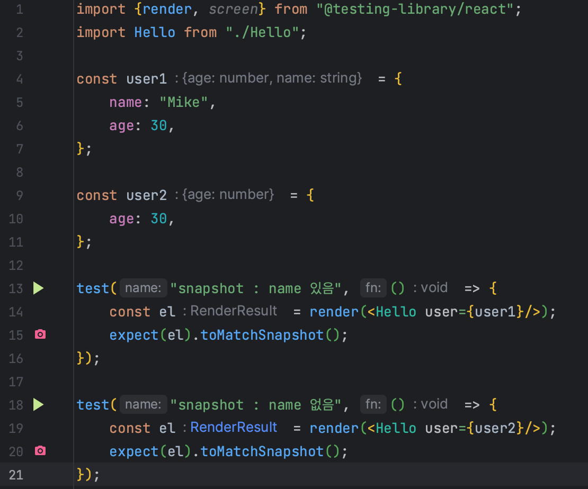
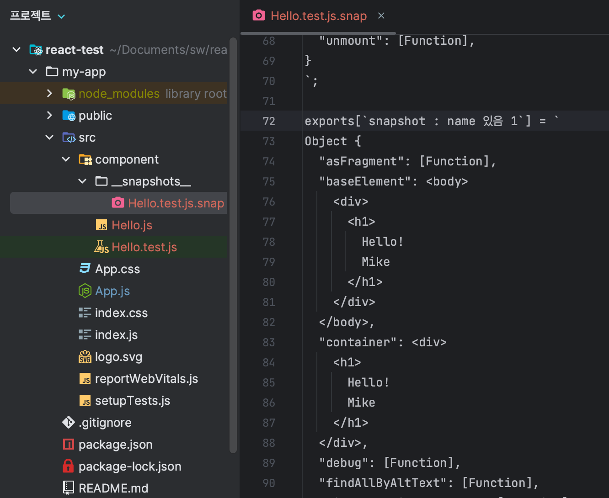
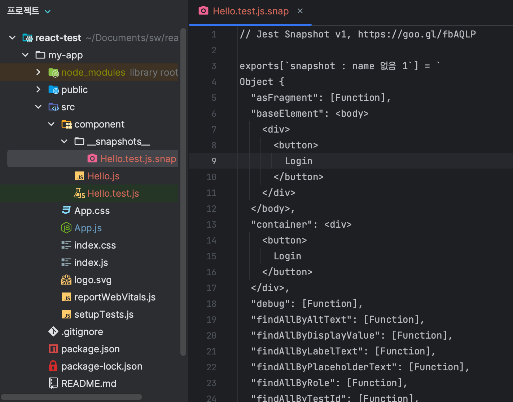

# 컴포넌트 테스트

컴포넌트 예시

```js
export default function Hello ({ user }) {
    return user.name ? <h1>Hello! {user.name}</h1> : <button>Login</button>
}
```


테스트 코드

```js
import {render, screen} from "@testing-library/react";
import Hello from "./Hello";

const user = {
    name: "Mike",
    age: 30,
};

test("Hello라는글자가포함되는가?", () => {
    render(<Hello user={user}/>);
    const helloEl = screen.getByText(/Hello/i);
    expect(helloEl).toBeInTheDocument();
});
```


결과

```
 PASS  src/component/Hello.test.js
  ✓ Hello라는글자가포함되는가? (12 ms)

Test Suites: 1 passed, 1 total
Tests:       1 passed, 1 total
Snapshots:   0 total
Time:        0.622 s, estimated 1 s
Ran all test suites related to changed files.

```


## snapshot

```js
import {render, screen} from "@testing-library/react";
import Hello from "./Hello";

const user1 = {
    name: "Mike",
    age: 30,
};

const user2 = {
    age: 30,
};

test("snapshot : name 있음", () => {
    const el = render(<Hello user={user1}/>);
    expect(el).toMatchSnapshot();
});

test("snapshot : name 없음", () => {
    const el = render(<Hello user={user2}/>);
    expect(el).toMatchSnapshot();
});
```

npm test하면

```js
 PASS  src/component/Hello.test.js
  ✓ snapshot : name 있음 (9 ms)
  ✓ snapshot : name 없음 (4 ms)

 › 2 snapshots written.
Snapshot Summary
 › 2 snapshots written from 1 test suite.
```


아래처럼 스냅샷이 생긴다.







이전 스냅샷과 다른 경우 실패가 발생한다.

이 때문에 동적인 데이터를 넣는 경우 실패가 반복적으로 나타나고, 때문에 이를 무시하는 코드도 존재한다.
