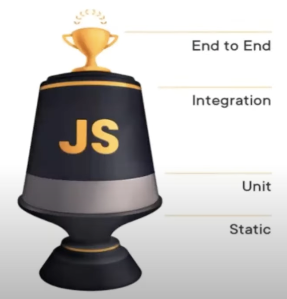
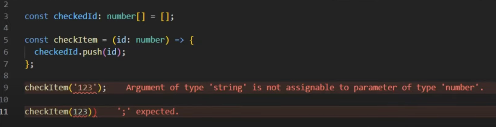

### 왜 테스트가 필요할까?

-개발자가 만든 어플리케이션은 언젠가 테스트를 거친다. 개발자인 우리가 테스트하거나, 사용자가 하거나 둘 중 하나다- by Kent C. Dodds

TDD 접근법 = 요구사항에서 부터의 접근법

요구사항을 충족하는 테스트를 작성한다.

e2e

프론트엔드 TDD

Test-Driven Development의 흐름

1. 테스트 코드 작성 : 구현하려는 동작을 설명하는 테스트 코드를 작성한다. 아직 동작을 구현하는 코드를 작성하지 않았으므로 테스트는 실패 해야한다.
2. 테스트 실행 : 테스트를 실행한다. (실패한다)
3. 코드작성 : 동작을 구현하는 코드를 작성한다. 이때 테스트를 통과하기 위한 목적으로만 작성한다. 아직 존재하지 않는 많은 문제를 생각하지 말고, 테스트 목표에 집중한다.
4. 테스트 실행 : 테스트를 실행한다.
5. 리팩터링 : 테스트를 통과하면 코드를 리팩터링 한다.

TDD 이점

- 테스트를 먼저 작성함으로써, 개발자는 구현하려는 동작에 대해 먼저 생각하게 되어 특정한 요구사항에 맞는 코드를 작성할 수 있다.
- 코드의 유지보수성을 향상시키고, 시간이 지나도 프로젝트의 유지 관리가 쉬워진다.
- 코드 수정 시 미처 생각지 못한 부분(기존 코드에 영향을 받는)에 대한 문제점을 미리 파악할 수 있다.
- 애플리케이션에 대한 신뢰성이 높아진다.
- 테스트 코드는 동작 방식을 설명하니, 테스트 파일 자체를 문서로 활용할 수 있다.
- 각종 에러 케이스에 대한 생각을 많이 하게 되므로 두뇌 건강에 좋다.

# 테스트 종류

프론트엔드 테스트는 UI가 존재한다는 특징이 있다.

자동화 테스트 (Automated Test)

- 코드로 작성, 반복적

수동 테스트(Menual Test)

- 브라우저에서 직접 전근

### Static Test 정적 테스트

테스트 도구: Typescript, eslint

구문오류와 타입오류를 감지해 알려줘서 런타임 에러를 방지할 수 있다.

### Unit Test 단위 테스트

가장 작은 단위(하나의 함수, 메소드, 클래스, 모듈 등)가 의도한 대로 작동하는 지 테스트

Input에 대한 올바른 Output을 반환하는지 테스트

테스트 도구 : jest, mocha, react-testing-library 등

### Integration Test 통합 테스트

여러개의 모듈, 컴포넌트 등이 상호작용하며 잘 동작하는 지 테스트

주로 비즈니스로직과 연관된 테스트

테스트 도구: react-testing-library, Enzyme 등

api와 컴포넌트를 결합한 통합 테스트 예시

### E2E 테스트

사용자가 어플리케이션에서 경험할 것으로 예상되는 행동을 코드로 작성해 검증하는 테스트

다루는 범위가 큼

테스트 도구: cypress, puppeteer등

예시) 시나리오 테스트

### UI테스트

컴포넌트가 예상한 대로 화면에 그려지는 지 테스트

테스트 도구: Storybook, Bit, stylegudist 등

### 웹 접근성 테스트

장애인, 고령자, 저시력자, 색각 이상자 등 다양한 사용자 그룹이 웹사이트를 접근하고 이용할 수 있는지 테스트

테스트 도구: Storybook, accessibility addons, 스크린 리더, Wave

### 크로스 브라우저 테스트

# 레퍼런스

https://www.youtube.com/watch?v=MN7Pw4mK6lU

https://velog.io/@bluestragglr/시각적-회귀-테스트로-서비스-안정성-끌어올리기