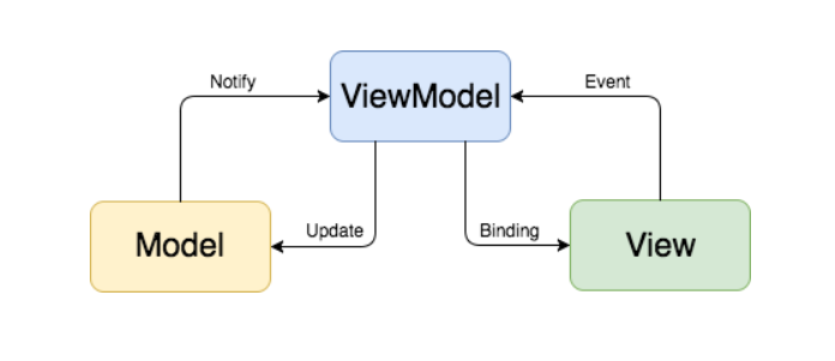
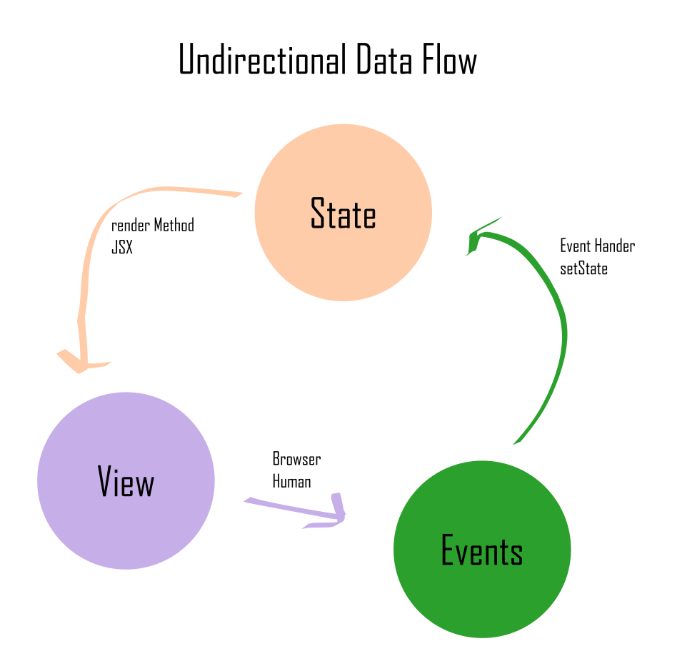
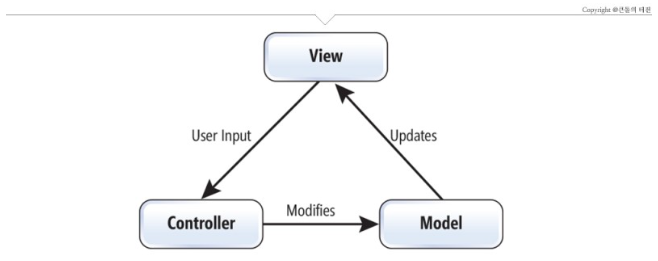
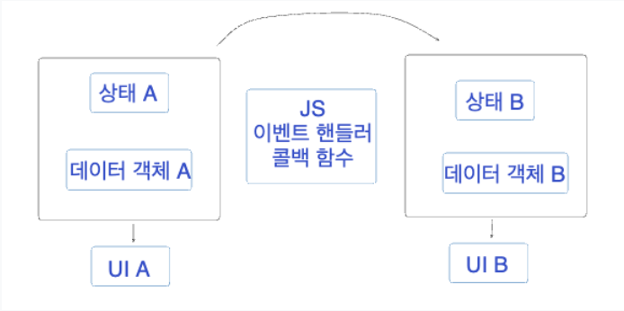
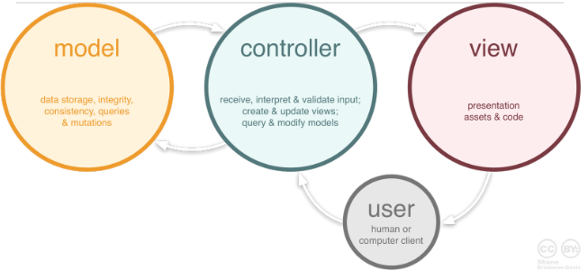

### 요약

- react는 이벤트 핸들러를 등록해야 되고, 데이터의 흐름 상 단방향 데이터 바인딩이다.
- vue, anguler 등은 mvvm패턴과 같이 중간에서 데이터를 양방향으로 바인딩 해주는 것이 존재한다.

### 일단 데이터바인딩이란?

<aside>
💡 *In computer programming, data binding*

- 데이터 바인딩(data binding)은 제공자와 소비자로부터 데이터 소스를 묶어 동기화하는 기법이다.
- 보통 XML 데이터 바인딩과 UI 데이터 바인딩에서처럼 서로 다른 언어를 사용하는 두 개의 데이터/정보 소스로 이루어진다.
- UI 데이터 바인딩에서는 언어와 다른 로직 함수의 데이터 및 정보 객체가 서로 결합된다.(예: 자바 UI 요소를 자바 객체와 묶는 것)

[wikipedia - data binding](https://ko.wikipedia.org/wiki/%EB%8D%B0%EC%9D%B4%ED%84%B0_%EB%B0%94%EC%9D%B8%EB%94%A9)

</aside>

요약하면 **연결된 특정 두 데이터 혹은 소스를 일치시키는 기법**을 말한다. 

특정 데이터를 화면에 보여줘야 한다면 데이터가 변경되며 화면에 보여지는 데이터도 변경되어야 한다. 이 두 데이터를 여러가지 방법을 통해 묶어주는 것이다. 

묶어주는 방식을 통해 양방향, 단방향 데이터 바인딩이 존재한다. 이를 사용한 vue와 react예제를 확인해봅시다.

## Vue의 데이터 바인딩

Vue를 공부했던 사람이라면 아래 예제처럼 `v-bind`, `v-model`문법을 봤을 것이다.

```html
<template>
    <div>
				<div v-bind:class="{ active: isActive }"></div>
        <textarea
	          type="textarea"
	          placeholder="내용을 입력해주세요"
	          v-model="content" />
    </div>
</template>

<script>
export default {
    data() {
		  return {
		    isActive: true,
				content: ""
		  }
		}
};
</script>
```

그럼 v-bind와 v-model이 공식문서에 뭐라고 적혀있을까?

`v-bind` : “하나 이상의 속성 또는 컴포넌트 prop을 표현식에 동적으로 바인딩합니다.”

`v-model` : “사용자 입력을 받는 폼(form) 엘리먼트 또는 컴포넌트에 양방향 바인딩을 만듭니다.”

단방향 데이터 바인딩인 v-bind는 데이터가 바뀔 때 마다 속성을 업데이트해준다. 그렇지만 속성이 업데이트 된다고 데이터가 바뀌지 않는다.

### v-model

v-model이 구현되는 원리에 대해서 공식문서에서 가져왔다.

<aside>
💡 먼저 네이티브 엘리먼트에서 v-model이 어떻게 사용되는지 다시 살펴봅시다

```html
<input v-model="searchText" />
```

내부적으로 템플릿 컴파일러는 v-model을 좀 더 자세한 표현으로 확장합니다. 따라서 위의 코드는 다음과 같은 작업을 수행합니다

```html
<input
  v-bind:value="searchText"
  @input="searchText = $event.target.value"
/>
```

이와 같이 이벤트가 발생하면 데이터를 바꿔주며 양방향 데이터 바인딩을 만듭니다.

</aside>

v-model 같은 경우는 v-bind, v-on 의 기능이 축약된 디렉티브란 것을 알 수 있다.

- 디렉티브: Directive(디렉티브)는 프로그래밍에서 특정 동작이나 역할을 수행하기 위해 사용되는 지시(Instruction)를 의미합니다. 디렉티브는 일반적으로 템플릿(Template)이나 마크업(Markup) 언어에서 발견되며, 특정 요소에 적용되어 원하는 동작이나 변화를 적용하는 역할을 수행합니다.

아래는 [단테님의 블로그](https://velog.io/@jay/uni-bidirectional)에서 가져온 말이다.

<aside>
💡 Vue와 Angular의 v-model, ngModel 디렉티브는 화면의 입력요소와 코드 상의 변수를 자동으로 연결해줍니다. 즉 입력 요소의 value 속성이나 ngModel 디렉티브가 참조하는 값은 DOM에 저장되어 있으며, 코드 상의 변수는 그 값을 복사하여 사용합니다.

view를 표현하기 위한 직접적인 상태 값을 다루는 controller를 다룰 필요가 없다

</aside>

### MVVM 패턴



여기서 MVVM 패턴을 보고 조금이나마 이해를 할 수 있었던 것 같습니다.

- ViewModel(v-model)이 View(DOM)에 Binding해놓으면 Event(@input)를 통해 데이터가 전달되고 업데이트 되게 됩니다.
- ViewModel이 데이터 전달을 원활하게 처리해줍니다.

정도로 이해한 것 같습니다.

## React의 단방향바인딩



리엑트에서 컴포넌트의 상태를 변경하면 뷰가 업데이트 됩니다. 그리고 상태를 업데이트하기 위해서는 유저가 화면을 통해 이벤트를 발생시켜야 합니다.

View에서 상호작용을 하면 Event를 통해 setState를 합니다. 더해서 state가 렌더링 되며 view에 적용시키게 됩니다. 이를 패턴에 대입해서 알아봅시다.

### MVC패턴



여기서 state와 view사이에 대신 처리해줄 매개체인 Event가 Controller에 할당되고, 데이터를 적용시키는 방식이 단방향 데이터인 것 같습니다.

```jsx
// react
const [state, setState] = useState(0);

const handleClick = () => {
   // ?
}

return (
  <div>
    <button onClick={handleClick}>+</button>
    <div>{state}<div>
  </div>
)
```

여기서 handleClick에 따로 setState를 작성해야 데이터를 변경시킬 수 있다.

아래도 이해를 돕기위해 [단테님의 블로그](https://velog.io/@jay/uni-bidirectional)에서 가져온 말입니다.

<aside>
💡 명령형 프로그래밍이든 선언형 프로그래밍이든 화면을 표현하는 요소를 업데이트하기 위해서는 js 코드 내부에서 명시적으로 바인딩하는 요소가 있어야 합니다.



단방향 바인딩은 화면의 데이터와 메모리의 데이터가 한 방향으로만 영향을 주는 방식이기 때문에 상태 관리에 용이하고 성능 최적화에 용이합니다. 어떤 변화가 어디서 발생했는지 명확하게 알 수 있습니다. 필요한 경우에만 화면을 업데이트하기 때문에 성능 저하나 메모리 누수등의 문제를 방지할 수 있습니다.

이에 대한 트레이드 오프로 화면을 변경하는 요소를 일일이 js로 뷰와 바인딩해주고 업데이트 하는 핸들러 로직을 작성하기 때문에 코드가 복잡해질 수 있습니다.

양방향 바인딩과 uncontrolled component는 모두 화면의 입력 요소와 코드 상의 변수를 직접 연결하지 않고 DOM에 의해 관리되는 값을 사용한다는 공통점이 있습니다.

- 관리: View를 표현하는 Model인 상태 값을 이벤트 핸들러(Controller)를 이용해 직접 업데이트
</aside>

## 의문점

하지만 이를 다 보아도 명쾌하게 이해가 쉽지 않습니다…  v-model도 v-on과 v-bind를 축약해 놓은거면, React도 Custom Hook을 이용해 적절히 축약해서 표현할 수 있다. 그럼 결국 다 양방향아냐..?..?

실제로 [큰돌의 터전님의 블로그](https://m.blog.naver.com/jhc9639/220967034588)에 있는 MVC패턴 이미지를 보면 더 헷갈린다.



### 그래서 도출해낸 예상 차이점(틀릴 수 있음)

- React는 jsx기반으로 state가 바뀌려면 렌더함수가 호출 될 때에만 클로저값이 변경된다. 이것이 데이터흐름을 바인딩하는 역할과 좀 다른 것 같다. 오히려 끊어져 있는 것 같기도?
- Vue는 프레임워크다보니, 이벤트 처리 과정에서 DOM과 좀 더 밀접하게 연관되어 있으며 블랙박스다. 예시로, v-model을 사용하면 한글이 이상하게 동작하는 버그가 있다.
- 옵저버가 존재하냐 존재하지않냐 차이일 수도 있다.

### 참고자료

<aside>
💡 https://velog.io/@dongwan999/Data-Binding

https://velog.io/@jay/uni-bidirectional

https://www.youtube.com/watch?v=2Fr69gOLpAA

</aside>

### 같이 공부하면 좋을 것 같은 자료

<aside>
💡 https://www.youtube.com/watch?v=RD5ZWoUMmMk

</aside>