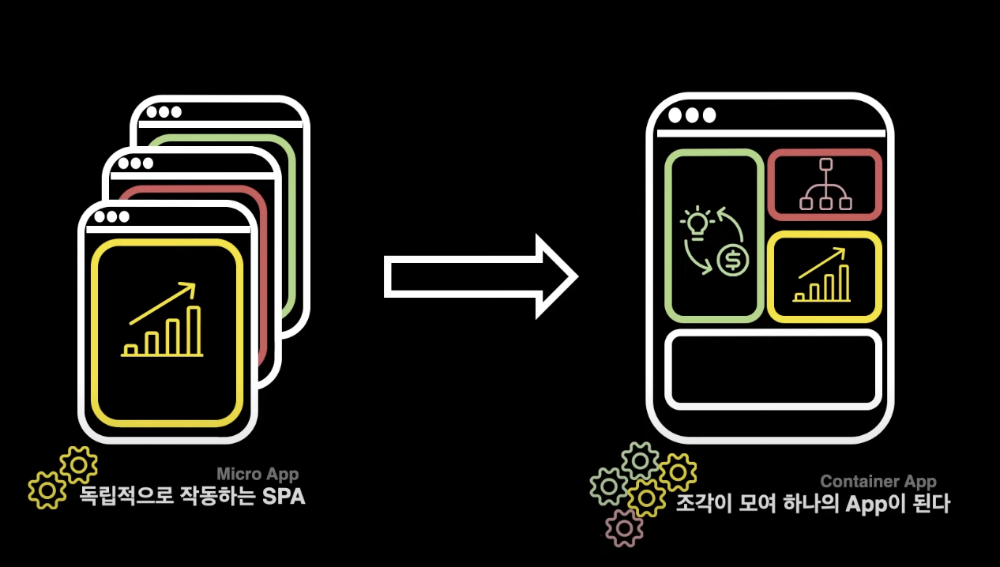
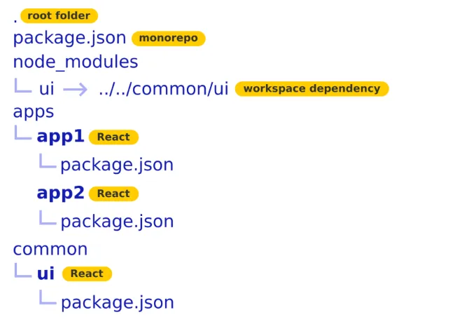
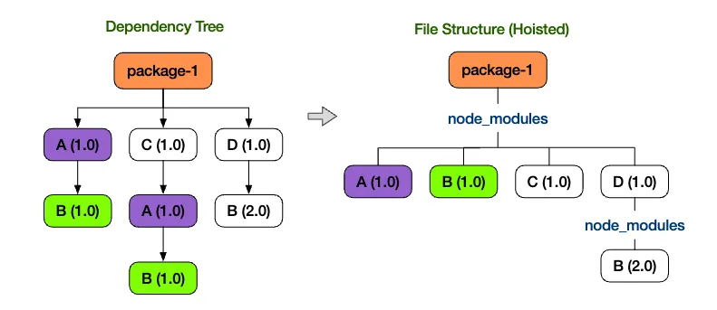
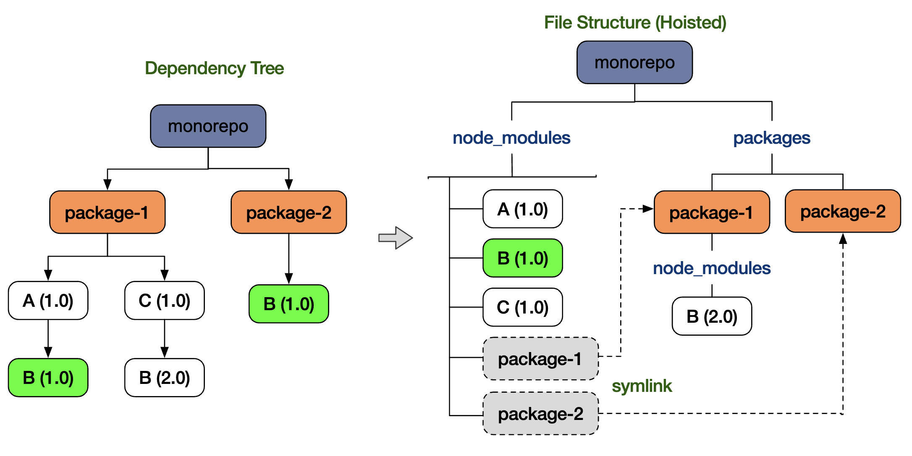
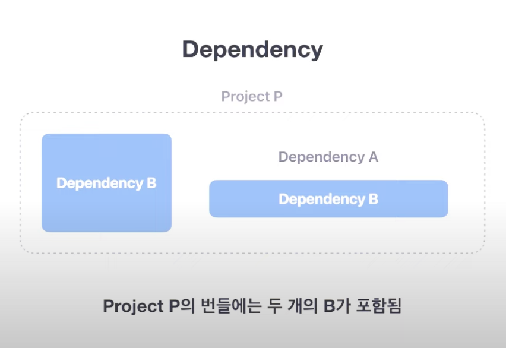

# 프론트엔드 아키텍처 구축

# 서론

포폴같은 사이트 만들까 계획 중이라, Next도 쓰고 React도 쓰고 하고 싶은데, 어떤 방법이 있을까해서 찾아보았다.
근데 이해가 안되서 3개 정도의 유튜브를 찾아보았다.

# 카카오 MFA

[MFA, 누구냐 너: 공통 플랫폼개발 파트의 MFA도입기 / if\(kakao\)2022](https://www.youtube.com/watch?v=_SkngG2RR3Q)

## 필요해진 이유

같은 정보를 표출하는데, 서로 다른 어플리케이션에서 중복적인 개발을 하게되었다.

서비스가 비대해지면 서로 다른 조직이 운영해야하는 경우가 생길 수 있음.

- 업무 결합도 증가

## 마이크로 프론트엔드 아키텍처

다른 조직에서만든 SPA를 MFA형태로 인젝션(주입)하여 만든 마이크로 프론트엔드 어플리케이션이다.

## 이점

- 응집력 있는 코드베이스를 가질 수 있다.
  - 분리된 프론트엔드 어플리케이션 속성에 응집력있는 코드로 유지가 가능
- 유지보수, 배포 등 업무의 분리
  - 코드관리, 배포 등 조직 단위로 이루어지는 업무들이 Micro App 단위로 분리되므로 앱마다 자율적이고 확장적 개발이 가능하다.
- 점진적 업데이트
  - 각 조직들은 각자 맡은 Application에 대해 자율적으로 업데이트 할 수 있으므로, Container App의 관점에서 점진적 업데이트가 가능

# MFA 구현방법 5가지

### 1. Iframe을 통한 통합

- 간단하고 확실.
- Micro <- -> Container 앱간 통신에 제약
- Micro App이 깔끔하기 붙기 어렵다.

## 2. Web-component를 통한 runtime 통합

- Micro App을 하나의 Custom-element로 만들어 Container App에서 runtime환경에서 Injection하는 방식
- 오브젝트형식의 많은 데이터를 넘겨야 할 경우 어트리뷰트 스트링형식으로 보내야 하는 제약이 있다.

## 3. NGINX를 통한 Routing

- NGINX에서 유입된 URL에 따라 표출할 HTML을 결정
- 단순한 Routing 정도 수준이지만 각 어플리케이션들이 분리되어 개발, 배포되어 있어야하기 때문에 MFA방식 중 하나
- 그러나 컴포넌트처럼 조각으로 이용하려면 맞지않다.

## 4. Micro app을 NPM 모듈화로 build 통합

- 이 방법은 빌드타임통합이므로 마이크로앱의 배포가 완전히 분리될 수 없다.

## 5. 번들링된 JS와 CSS를 runtime으로 다운로드하여 micro app을 injection

- 기존 코드를 바꾸지 않고 mfa를 적용할 수 있다.
- 카카오에서 채택!

# 구현방법

마이크로 프론트엔드 어플리케이션의 구동방식은 **컨테이너 앱**에 **마이크로앱**으로 구현된 어플리케이션
(컨테이너 앱 > 마이크로앱)
컴포넌트로 인젝션 하기위해 해당 마이크로 앱의 url주소로 매니페스트 json 파일(마이크로 앱 정보)을 요청한다.
요청을 받은 마이크로앱은 주소를 보내주고, 컨테이너는 그 주소로 요청을 보내어 js와 css파일 등이 번들링된 파일을 내려받게 된다. 이렇게 마이크로 앱을 컨테이너 앱에 인젝션 하게 된다.

### 얻은 효과

1. 조직간 업무 결합도 감소
   서로 다른 조직이 각자 다른 일을 해도 된다.
2. 컴포넌트 재사용성 증가
   SPA를 Micro app으로 이용할 수 있게 되어 재사용성이 증가하였고, 큰 조직 단위에서의 효율이 증대됨

### 해결과제

1. 과도한 payload 크기
   공통적으로 사용하는 library가 번들링 된 js마다 존재하므로 payload크기가 과도하게 커진다.
   코드 스플리팅 과 같은 다이나믹 임포트가 지원되는데, 이건 좀 큰 문제다
2. 운영복잡도 증가
   1. 분리된 어플리케이션마다 각각 다른 빌드, 배포 파이프라인이 있어야한다.
3. css오염문제
   1. 번들링된 css를 컨테이너에 인젝션하면 다른 마이크로 앱의 css를 오염시킬 수 있다.
4. 컨테이너 앱과 모든 마이크로앱이 하나의 윈도우를 공유하므로, 개발과정에서 테스팅하기 어렵고 원인 디버깅이 어렵다.

# 콴다

[팀워크 향상을 위한 모노레포\(Monorepo\) 시스템 구축](https://blog.mathpresso.com/%ED%8C%80%EC%9B%8C%ED%81%AC-%ED%96%A5%EC%83%81%EC%9D%84-%EC%9C%84%ED%95%9C-%EB%AA%A8%EB%85%B8%EB%A0%88%ED%8F%AC-monorepo-%EC%8B%9C%EC%8A%A4%ED%85%9C-%EA%B5%AC%EC%B6%95-3ae1b0112f1b)
멀티레포 운영의 문제점:

- 각 프로젝트의 코드 컨벤션이 통일하기가 어려워질 수 있습니다.

* 각 프로젝트별로 사용하는 모듈 및 버전 스택이 달라질 수 있습니다.
* 오랫동안 건드리지 않은 프로젝트의 관리가 힘들어지며, 시간이 지날수록 해당 프로젝트의 Legacy 파악이 어려워질 수 있습니다.
* 팀원별 컨텍스트 공유가 서로 원활하지 않을 수 있습니다.

해결법 :

- Yarn Workspace를 통한 모노레포의 전체적인 Dependency 관리, 그리고 하위 디렉토리 내 프로젝트의 Dependency 관리
- Yarn Workspace의 디렉토리 구조
  
- 프로젝트가 Hoisting되는 방식
- 
- yarn workspace에서는 아래처럼 나타남
  
  [nohoist in Workspaces](https://classic.yarnpkg.com/blog/2018/02/15/nohoist/)
- 중복되는 모듈 설치를 줄이고 전체적인 Dependency 사이즈를 줄일 수 있다.

한계 :

- 불안전한 Yarn workspace Hoisting
- 주기적인 CI/CD로 빌드 문제가 발생하지 않도록 해야한다.

결과 :

- 모든 웹 프로젝트의 최신화 상태 유지
- 컨벤션 통일 및 업무 능률 향상

# 토스

https://www.youtube.com/watch?v=Ix9gxqKOatY
일백개의 모노레포 우아하게 운영하기

## 모노레포란?

잘 정의된 관계를 가진 여러개의 독립적인 프로젝트들이 있는 하나의 레포지토리다.

## 멀티레포와 모노레포

각각의 서비스 라이브러리들이 각각의 레포지토리에 있다.

### 멀티레포의 문제점

1. 새 프로젝트 생성 비용이 큼
   프로젝트 세팅(cicd, lint, test, ts 등) 설정을 반복해줘야한다.
2. 프로젝트간 코드 공유가 어려움
3. 같은 이슈를 수정하기 위해 각각의 레포지토리에 커밋이 필요
4. 히스토리 관리의 어려움
5. 제각각인 툴링으로 개발자 경험이 일관적이지 않다

### 모노레포의 장점

1. 새 프로젝트 생성비용 작음
2. 프로젝트간 코드 공유 쉽다.
3. Atomic commits(커밋하나로 모두 수정가능)
4. 히스토리 관리가 쉽다.
5. 공통된 툴링으로 일관적인 개발자 경험 제공

무작정 하나의 레포에 담아버리면 잃는 것들이 많다.

### 모던 모노레포 툴에서 제공하는 기능들

1. 속도
   1. 로컬 캐싱
   2. 로컬 task 자동화설정 같은 머신에서 효율적으로 테스크 관리 가능
   3. 어떤 머신에서든 원격저장 캐싱되어 빠른 작업시행이 가능하다.
   4. 변경된 프로젝트 감지
      1. 어떠한 프로젝트가 변경되었는지 파악하여 관리할 수 있다.
2. 관리
   1. 프로젝트간 코드공유
   2. 스케폴딩등 코드생성을 쉽게할 수 있다.
   3. 프로젝트간 의존성을 관리할 수 있다.
      1. 예. 프라이빗 프로젝트

## 토스 프론트엔드 라이브러리 운영

크고작은 라이브러리로 구성되어있다.

### 모노레포를 두개로 나누었다.

- 라이브러리 온니 모노레포 /서비스 모노레포
- 커밋수가 라이브러리는 작고 / 서비스는 훨씬 크다.
- 배포방식 : npm / 내부인프라로 내부 웹서버
- 커밋 영향범위 : 큼 / 작음

---

### 라이브러리 모노레포의 특징

1. 의존성 관리
   1. 비효율적이고 깨져있는 부분이 많다.
   2. Phantom Dependency 문제가 있다.
   3. 명시되지않은 라이브러리를 쓸수있는것은 많은 에러를 내포하고 있다.
   4. Yarn berry + pnp 방식 사용
   5. 노드모듈스에 호이스팅되는 방식이 아니라 yarn cache에 압축파일로 제공된다.
   6. .pnp.cjs 파일에 엄격하게 관리되고 명시되지 않은 의존성을 코드에서 사용될수 없고 팬텀디펜던시를 해결할 수 있다.
   7. Zero install
   8. 빠른 의존성 검색
   9. Peer dependency?
      
   10. 패키지를 사용하는 것에서 필요한 dependency
   11. 2개의 B가 필요할 수 있다.
   12. B가 A의 퓨어디펜던시로 제공되어있으면 의존성 책임이 P에게 가고, P를 번들링하면 1개만 있으면 된다.
   13. **런타임에서 에러가 발생할 수 있다.**
   14. 그럼 peer Dependency를 잘 사용하려면?
       1. 싱글턴으로 패키지를 사용해야될 때 react 나 next.js를 peer de로 쓴다.
   15. semver란 버전넘버가 어떻게 할당되고 증가되는지 규칙과 요구사항이다.
   16. semver버전을 엄격하게 유지하는 것이 중요하다.
       1. Learn 를 사용해서 해결중이다.
2. 코드품질관리
   1. 제도와 장치를 이용중이다.
   2. RFC 아이디어만 RFC를 올리면 설계와 리뷰, 피드백을 받을 수 있다.
   3. 구현전 단계에서 이슈를 올려 상세한 리뷰를 받을 수 있다.
   4. PR을 올리면 리뷰를 받는다. CI가 동작하고 코드검증이 올라간다.
   5. ci:디펜던시 검증, 데드 코드 검증, 프리팩 배포전 빌드가 잘되는지 체크해주고 테스트 버전이 잘 관리되고있는지 체크
   6. 이는 모노레포이기 때문에 더 잘 관리할 수 있다.
   7. 각각의 레포지토리면 어렵다.
3. 문서화
   1. 라이브러리임에만큼 문서와 시스템을 구축하였다.

Slash 컨퍼런스 / 획을 긋다.
프론트 챕터에서 사용하는 모노레포

토스에서 실제 사용하고 있는 모노레포
[toss/slash: A collection of TypeScript/JavaScript packages to build high-quality web services.](https://github.com/toss/slash)

#

#
